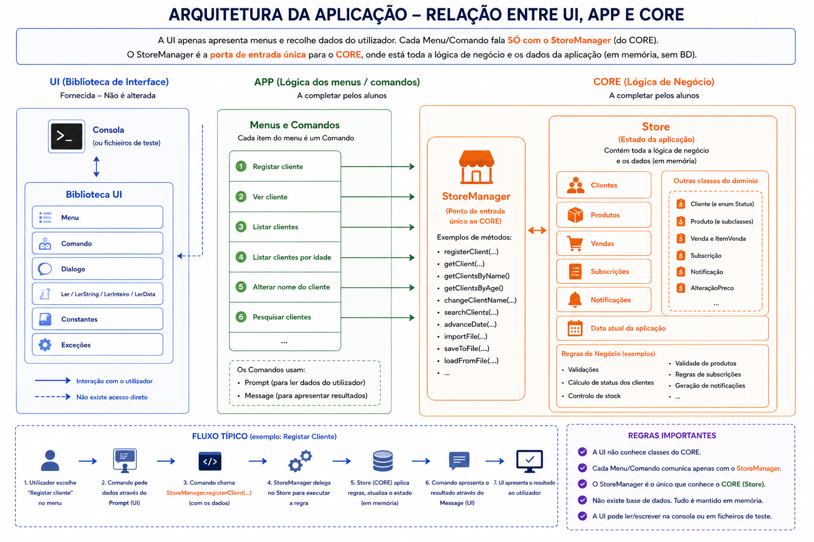

# Enunciado de Projeto — Loja da ATEC


<!-- TOC -->
* [Enunciado de Projeto — Loja da ATEC](#enunciado-de-projeto--loja-da-atec)
* [1. Introdução](#1-introdução)
  * [1.1 Enquadramento](#11-enquadramento)
  * [1.2 Organização da aplicação](#12-organização-da-aplicação)
    * [1.2.1 Módulo `ui`](#121-módulo-ui)
    * [1.2.2 Módulo `app`](#122-módulo-app)
    * [1.2.3 Módulo `core`](#123-módulo-core)
  * [1.3 Validações dos dados de entrada](#13-validações-dos-dados-de-entrada)
    * [1.3.1 Validação de formato](#131-validação-de-formato)
    * [1.3.2 Validação das regras de negócio](#132-validação-das-regras-de-negócio)
* [2. Principais Conceitos](#2-principais-conceitos)
  * [2.1. Loja](#21-loja)
  * [2.2. Data simulada](#22-data-simulada)
  * [2.3. Cliente](#23-cliente)
  * [2.4. Status do cliente](#24-status-do-cliente)
    * [2.4.1. Faixas etárias](#241-faixas-etárias)
    * [2.4.2. Regras aplicáveis a clientes jovens](#242-regras-aplicáveis-a-clientes-jovens)
    * [2.4.3. Regras aplicáveis a clientes adultos](#243-regras-aplicáveis-a-clientes-adultos)
    * [2.4.4. Regras aplicáveis a clientes seniores](#244-regras-aplicáveis-a-clientes-seniores)
    * [2.4.5. Regras de classificação](#245-regras-de-classificação)
    * [2.4.6. Alteração da faixa etária](#246-alteração-da-faixa-etária)
    * [2.4.7. Subida e descida de status](#247-subida-e-descida-de-status)
  * [2.5. Produto](#25-produto)
    * [2.5.1 Produtos de alimentação](#251-produtos-de-alimentação)
    * [2.5.2 Produtos de eletrónica](#252-produtos-de-eletrónica)
    * [2.5.3 Produtos de vestuário](#253-produtos-de-vestuário)
    * [2.5.4 Histórico de preços de cada Produto](#254-histórico-de-preços-de-cada-produto)
  * [2.6 Venda](#26-venda)
  * [2.7 Subscrição](#27-subscrição)
  * [2.8 Notificação](#28-notificação)
  * [2.9 Guardar e abrir o estado da aplicação](#29-guardar-e-abrir-o-estado-da-aplicação)
* [3. Trabalho a realizar pelos alunos](#3-trabalho-a-realizar-pelos-alunos)
* [4. Funcionalidas da Aplicação (Menus e comportamento)](#4-funcionalidas-da-aplicação-menus-e-comportamento)
  * [4.1. Menu Principal](#41-menu-principal)
    * [4.1.1. Abrir Gestão de Clientes](#411-abrir-gestão-de-clientes)
    * [4.1.2. Abrir Gestão de Produtos](#412-abrir-gestão-de-produtos)
    * [4.1.3. Abrir Gestão de Vendas](#413-abrir-gestão-de-vendas)
    * [4.1.4. Abrir Gestão de Notificações](#414-abrir-gestão-de-notificações)
    * [4.1.5 Avançar data](#415-avançar-data)
      * [4.1.5.1. Fluxo da operação](#4151-fluxo-da-operação)
      * [4.1.5.2. Validação](#4152-validação)
      * [4.1.5.3 Atualização do status dos clientes](#4153-atualização-do-status-dos-clientes)
    * [4.1.6 Consultar resumo da loja](#416-consultar-resumo-da-loja)
    * [4.1.7 Consultar detalhes avançados da loja](#417-consultar-detalhes-avançados-da-loja)
    * [4.1.8 Guardar estado da aplicação](#418-guardar-estado-da-aplicação)
    * [4.1.9 Abrir estado da aplicação](#419-abrir-estado-da-aplicação)
  * [4.2. Menu de Gestão de Clientes](#42-menu-de-gestão-de-clientes)
    * [4.2.1 Registar cliente](#421-registar-cliente)
      * [4.2.1.1. Importação inicial de dados de Clientes](#4211-importação-inicial-de-dados-de-clientes)
      * [4.2.1.2. Configurar a importação no IntelliJ IDEA](#4212-configurar-a-importação-no-intellij-idea)
      * [4.2.1.3. Completar a importação de clientes](#4213-completar-a-importação-de-clientes)
    * [4.2.2 Ver cliente](#422-ver-cliente)
    * [4.2.3 Listar clientes](#423-listar-clientes)
    * [4.2.4 Listar clientes por idade](#424-listar-clientes-por-idade)
    * [4.2.5 Alterar nome do cliente](#425-alterar-nome-do-cliente)
    * [4.2.6 Pesquisar clientes](#426-pesquisar-clientes)
  * [4.3. Menu de Gestão de Produtos](#43-menu-de-gestão-de-produtos)
    * [4.3.1 Registar produto](#431-registar-produto)
      * [4.3.1.1 Importação inicial de produtos](#4311-importação-inicial-de-produtos)
      * [4.3.1.2 Configurar a importação no IntelliJ IDEA](#4312-configurar-a-importação-no-intellij-idea)
      * [4.3.1.3 Completar a importação de produtos](#4313-completar-a-importação-de-produtos)
    * [4.3.2 Ver produto](#432-ver-produto)
    * [4.3.3 Listar produtos](#433-listar-produtos)
    * [4.3.4 Listar produtos por categoria](#434-listar-produtos-por-categoria)
    * [4.3.5 Pesquisar produtos](#435-pesquisar-produtos)
    * [4.3.6 Alterar preço do produto](#436-alterar-preço-do-produto)
    * [4.3.7 Aumentar preços de uma categoria](#437-aumentar-preços-de-uma-categoria)
    * [4.3.8 Adicionar stock ao produto](#438-adicionar-stock-ao-produto)
    * [4.3.9 Consultar histórico de preços](#439-consultar-histórico-de-preços)
  * [4.4. Menu de Gestão de Vendas](#44-menu-de-gestão-de-vendas)
    * [4.4.1 Registar Venda](#441-registar-venda)
      * [4.4.1.1 Subscrição de notificações](#4411-subscrição-de-notificações)
    * [4.4.2 Ver venda](#442-ver-venda)
    * [4.4.3 Listar vendas](#443-listar-vendas)
    * [4.4.4 Listar vendas de um cliente](#444-listar-vendas-de-um-cliente)
  * [4.5. Menu de Gestão de Notificações](#45-menu-de-gestão-de-notificações)
    * [4.5.1 Consultar notificações de um cliente](#451-consultar-notificações-de-um-cliente)
    * [4.5.2 Consultar histórico de notificações](#452-consultar-histórico-de-notificações)
    * [4.5.3 Listar subscrições ativas](#453-listar-subscrições-ativas)
* [5. Ordem aconselhada de desenvolvimento do projeto](#5-ordem-aconselhada-de-desenvolvimento-do-projeto)
  * [5.1 Nota Importante](#51-nota-importante)
* [6. Regras Globais da Aplicação](#6-regras-globais-da-aplicação)
  * [6.1. Identificadores](#61-identificadores)
  * [6.2. Datas](#62-datas)
  * [6.3. Valores monetários](#63-valores-monetários)
  * [6.4. Clientes](#64-clientes)
  * [6.5. Produtos](#65-produtos)
  * [6.6. Stock](#66-stock)
  * [6.7. Vendas](#67-vendas)
  * [6.8. Subscrições](#68-subscrições)
  * [6.9. Notificações](#69-notificações)
  * [6.10. Pesquisa e ordenação](#610-pesquisa-e-ordenação)
  * [6.11. Validações](#611-validações)
  * [6.12. Separação entre módulos](#612-separação-entre-módulos)
  * [6.13. Persistência](#613-persistência)
* [7. Estrutura sugerida e boas práticas](#7-estrutura-sugerida-e-boas-práticas)
  * [7.1. Organização geral dos módulos](#71-organização-geral-dos-módulos)
  * [7.2. Estrutura sugerida para o módulo `app`](#72-estrutura-sugerida-para-o-módulo-app)
  * [7.3. Estrutura sugerida para o módulo `core`](#73-estrutura-sugerida-para-o-módulo-core)
  * [7.4. Responsabilidade do `StoreManager`](#74-responsabilidade-do-storemanager)
  * [7.5. Separação entre `app` e `core`](#75-separação-entre-app-e-core)
  * [7.6. Classes `Prompt` e `Message`](#76-classes-prompt-e-message)
    * [`Prompt`](#prompt)
    * [`Message`](#message)
  * [7.7. Lógica de negócio](#77-lógica-de-negócio)
  * [7.8. Encapsulamento](#78-encapsulamento)
  * [7.9. Coleções](#79-coleções)
  * [7.10. Comentários e documentação](#710-comentários-e-documentação)
  * [7.11. Boas práticas adicionais](#711-boas-práticas-adicionais)
* [8. Objetivos Pedagógicos](#8-objetivos-pedagógicos)
* [9. Avaliação e verificação](#9-avaliação-e-verificação)
  * [9.1. Testes automáticos](#91-testes-automáticos)
    * [9.1.1. Data simulada](#911-data-simulada)
    * [9.1.2. Gestão de clientes](#912-gestão-de-clientes)
    * [9.1.3. Gestão de produtos](#913-gestão-de-produtos)
    * [9.1.4. Gestão de vendas](#914-gestão-de-vendas)
    * [9.1.5. Status dos clientes](#915-status-dos-clientes)
    * [9.1.6. Subscrições e notificações](#916-subscrições-e-notificações)
    * [9.1.7. Resumo e detalhes avançados](#917-resumo-e-detalhes-avançados)
    * [9.1.8. Persistência](#918-persistência)
    * [9.1.9. Resumo das cotações dos testes automáticos](#919-resumo-das-cotações-dos-testes-automáticos)
  * [9.2. Análise da qualidade do código](#92-análise-da-qualidade-do-código)
  * [9.3. Observações](#93-observações)
  * [9.4. Apresentação](#94-apresentação)
<!-- TOC -->

---

# 1. Introdução

## 1.1 Enquadramento  

O objetivo deste projeto é desenvolver uma aplicação de consola em Java para gerir uma pequena loja.

A aplicação permitirá manter informação sobre clientes, produtos, vendas, alterações de preços, subscrições e
notificações. Será também possível avançar a data simulada da aplicação e guardar ou recuperar o estado da loja através
de serialização.

O projeto será desenvolvido progressivamente. Algumas classes relacionadas com a interface de utilizador já serão
fornecidas, permitindo concentrar o trabalho na implementação da lógica da aplicação.

---

## 1.2 Organização da aplicação

A aplicação na sua forma inicial (conforme disponibilizada no GIT) encontra-se organizada em três módulos:

```text
ui
app
core
```

---

### 1.2.1 Módulo `ui`

O módulo `ui` contém uma biblioteca responsável pela interação com o utilizador.

Esta biblioteca permite, entre outras coisas:

```text
Apresentar menus
Solicitar valores ao utilizador
Validar o formato dos valores introduzidos
Apresentar mensagens no ecrã
Redirecionar inputs e outputs para ficheiros de teste
```

> Este módulo é uma simplificação de uma biblioteca usada no IST e já se encontra implementado. Deste modo, não é
> permitido a sua alteração pelos alunos, sob o risco de toda a aplicação deixar de funcionar.

---

### 1.2.2 Módulo `app`

O módulo `app` contém a lógica dos menus e os comandos (opções de menu) disponíveis na aplicação.

Cada opção apresentada num menu corresponde a uma classe que herda de `Comando<StoreManager>`.

Exemplo:

```java
public class DoAdvanceDate extends Comando<StoreManager> {
    public DoAdvanceDate(StoreManager storeManager) {
        super(storeManager, Label.ADVANCE_DATE);
    }

    @Override
    public void executar() throws DialogException {
        // TODO: A completar pelos alunos
    }
}
```

As classes dos menus, as labels, os prompts e as mensagens serão fornecidas no módulo `atec.poo.loja.app`.

Os alunos deverão completar unicamente o método `executar()`, o qual se encontra identificado com um comentário. Vê o
exemplo abaixo:

```java

@Override
public void executar() throws DialogException {
    // TODO: A completar pelos alunos
}
```

Cada comando deverá:

```text
Solicitar os valores necessários através da classe Prompt
Invocar os métodos adequados do StoreManager
Apresentar os resultados através da classe Message
```

Os comandos não deverão conter regras de negócio.

---

### 1.2.3 Módulo `core`

O módulo `core` contém a lógica principal da aplicação.

Neste módulo deverão ser implementadas as classes que representam os conceitos do domínio da loja, bem como as
respetivas regras de negócio.

A UI comunica com o `core` através da classe:

```java
StoreManager
```

A classe `StoreManager` funciona como ponto de entrada para as operações da aplicação.

A classe principal do domínio será:

```java
Store
```

Esta classe será responsável por guardar e gerir o estado completo da loja.

---

### 1.2.4 Esquema Genérico



## 1.3 Validações dos dados de entrada

A aplicação deve distinguir dois tipos de validação.

### 1.3.1 Validação de formato

A validação de formato é assegurada pela biblioteca `ui`.

Exemplos:

```text
Garantir que foi introduzido um número inteiro
Garantir que foi introduzido um número decimal
Garantir que foi introduzida uma data válida
Garantir que foi introduzida uma resposta do tipo sim ou não
```

### 1.3.2 Validação das regras de negócio

As regras de negócio devem ser validadas no módulo `core`.

Exemplos:

```text
O número de dias a avançar deve ser superior a zero
Um cliente deve ter pelo menos 18 anos
O preço de um produto deve ser superior a zero
O stock de um produto não pode ser negativo
Um produto sem stock não pode ser vendido
Um produto alimentar fora do prazo não pode ser vendido
```

Desta forma, o estado da aplicação permanece sempre válido, independentemente da interface utilizada.

---

# 2. Principais Conceitos

A aplicação deverá permitir gerir o funcionamento de uma pequena loja.

Para isso, será necessário representar e relacionar vários conceitos do domínio:

```text
Loja
Cliente
Produto
Venda
Subscrição
Notificação
```

A aplicação deverá ainda manter uma data simulada e permitir guardar ou abrir o respetivo estado.

As classes `Store` e `StoreManager` serão fornecidas inicialmente, mas deverão ser completadas pelos alunos.

A organização das restantes classes, relações e estruturas necessárias faz parte do trabalho a desenvolver.

---

## 2.1. Loja

A loja representa o estado global da aplicação.

Deverá guardar e gerir toda a informação necessária ao funcionamento do sistema, nomeadamente:

```text
Clientes registados
Produtos disponíveis
Vendas realizadas
Subscrições ativas
Histórico de notificações
Data atual da aplicação
```

A loja deverá também garantir a atribuição automática de identificadores únicos e sequenciais aos diferentes elementos
do sistema.

Exemplo:

```text
Cliente 1
Cliente 2
Cliente 3
```

```text
Produto 1
Produto 2
Produto 3
```

```text
Venda 1
Venda 2
Venda 3
```

```text
Notificação 1
Notificação 2
Notificação 3
```

---

## 2.2. Data simulada

A aplicação deverá possuir uma data própria, independente da data real do computador.

Esta data será utilizada para:

```text
Calcular a idade dos clientes
Determinar o status dos clientes
Registar o momento das vendas
Registar alterações de preços
Registar subscrições
Registar notificações
Validar produtos com prazo de validade
```

Ao iniciar a aplicação, a data irá assumir um valor fixo definido no projeto (já implementado).

O utilizador poderá avançar a data através de uma opção do menu principal.

Deverá ser solicitado um número inteiro positivo de dias.

Exemplo:

```text
Data atual: 2026-01-01
Número de dias a avançar: 10
Nova data: 2026-01-11
```

Sempre que a data for alterada, o status de todos os clientes deverá ser recalculado.

---

## 2.3. Cliente

Um cliente representa uma pessoa registada na loja e autorizada a efetuar compras.

Cada cliente possui:

```text
Identificador único
Nome
NIF
Data de nascimento
Status (tipo categoria de cliente, baseado no seu perfil de compras)
```

O identificador deverá ser atribuído automaticamente e de forma sequencial no momento do registo.

Exemplo:

```text
Cliente [001] - Ana Silva - 28 anos - GOLD
```

Podem existir clientes com o mesmo nome. No entanto, cada cliente possui sempre um identificador único.

A loja não deverá permitir o registo de clientes menores de idade.

Regra:

```text
Um cliente deve ter pelo menos 18 anos.
```

A idade deverá ser calculada com base na data de nascimento do cliente e na data atual simulada da aplicação.

---

## 2.4. Status do cliente

Cada cliente deverá possuir um status que representa o seu nível de utilização da loja.

Os status possíveis são:

```text
REGULAR
SILVER
GOLD
PLATINUM
```

Um novo cliente começa sempre com o status:

```text
REGULAR
```

O status deverá ser recalculado:

```text
Sempre que a data simulada da aplicação for avançada
Sempre que o cliente efetuar uma compra
```

Um cliente poderá subir ou descer de status.

A alteração do status não depende diretamente do status anterior. Em cada recálculo, deverá ser determinada novamente a
classificação adequada, tendo em consideração:

```text
Idade atual do cliente
Valor total das compras realizadas
Período temporal analisado
```

A idade deverá ser calculada com base na data de nascimento do cliente e na data atual simulada da aplicação.

---

### 2.4.1. Faixas etárias

Os clientes deverão ser agrupados em três faixas etárias:

| Faixa etária |   Idade do cliente | Período analisado |
|--------------|-------------------:|------------------:|
| Jovem        | entre 18 e 24 anos |   últimos 60 dias |
| Adulto       | entre 25 e 64 anos |   últimos 30 dias |
| Sénior       |    65 ou mais anos |   últimos 90 dias |

Os períodos de análise são diferentes porque o padrão de compras esperado também é diferente.

Os clientes adultos possuem um período de análise mais curto e valores mínimos mais elevados.

Os clientes jovens e seniores possuem períodos de análise mais longos e valores mínimos mais acessíveis.

---

### 2.4.2. Regras aplicáveis a clientes jovens

Para clientes com idade compreendida entre 18 e 24 anos, deverão ser aplicadas as seguintes regras:

| Status     | Valor mínimo em compras | Período analisado |
|------------|------------------------:|------------------:|
| `PLATINUM` |                800,00 € |   últimos 60 dias |
| `GOLD`     |                400,00 € |   últimos 60 dias |
| `SILVER`   |                150,00 € |   últimos 60 dias |
| `REGULAR`  |              sem mínimo |   últimos 60 dias |

Exemplo:

```text
Um cliente com 20 anos e 450,00 € em compras nos últimos 60 dias
deverá possuir o status GOLD.
```

---

### 2.4.3. Regras aplicáveis a clientes adultos

Para clientes com idade compreendida entre 25 e 64 anos, deverão ser aplicadas as seguintes regras:

| Status     | Valor mínimo em compras | Período analisado |
|------------|------------------------:|------------------:|
| `PLATINUM` |               1800,00 € |   últimos 30 dias |
| `GOLD`     |                900,00 € |   últimos 30 dias |
| `SILVER`   |                350,00 € |   últimos 30 dias |
| `REGULAR`  |              sem mínimo |   últimos 30 dias |

Exemplo:

```text
Um cliente com 40 anos e 950,00 € em compras nos últimos 30 dias
deverá possuir o status GOLD.
```

---

### 2.4.4. Regras aplicáveis a clientes seniores

Para clientes com idade igual ou superior a 65 anos, deverão ser aplicadas as seguintes regras:

| Status     | Valor mínimo em compras | Período analisado |
|------------|------------------------:|------------------:|
| `PLATINUM` |                650,00 € |   últimos 90 dias |
| `GOLD`     |                300,00 € |   últimos 90 dias |
| `SILVER`   |                100,00 € |   últimos 90 dias |
| `REGULAR`  |              sem mínimo |   últimos 90 dias |

Exemplo:

```text
Um cliente com 70 anos e 350,00 € em compras nos últimos 90 dias
deverá possuir o status GOLD.
```

---

### 2.4.5. Regras de classificação

Para determinar o status de um cliente, a aplicação deverá:

```text
1. Calcular a idade atual do cliente
2. Determinar a faixa etária aplicável
3. Calcular o valor total das compras efetuadas dentro do período analisado
4. Avaliar os critérios do status mais elevado para o mais baixo
5. Atribuir o primeiro status cujos requisitos sejam cumpridos
```

A avaliação deverá ser feita pela seguinte ordem:

```text
PLATINUM
GOLD
SILVER
REGULAR
```

Exemplo:

```text
Um cliente com 22 anos e 900,00 € em compras nos últimos 60 dias
deverá possuir o status PLATINUM.
```

```text
Um cliente com 35 anos e 500,00 € em compras nos últimos 30 dias
deverá possuir o status SILVER.
```

```text
Um cliente com 68 anos e 50,00 € em compras nos últimos 90 dias
deverá possuir o status REGULAR.
```

---

### 2.4.6. Alteração da faixa etária

A faixa etária de um cliente também poderá mudar quando a data simulada da aplicação for avançada.

Nesse caso, no próximo recálculo deverão ser aplicadas as regras correspondentes à nova faixa etária.

Exemplo:

```text
Um cliente com 24 anos pertence à faixa etária Jovem.

Depois de completar 25 anos, passa a pertencer à faixa etária Adulto.

A partir desse momento, o seu status deverá ser calculado utilizando
os limites e o período de análise definidos para clientes adultos.
```

---

### 2.4.7. Subida e descida de status

Um cliente poderá subir ou descer de status ao longo do tempo.

Exemplo de subida:

```text
Um cliente adulto possui 300,00 € em compras nos últimos 30 dias.
O seu status é REGULAR.

Depois de efetuar uma compra de 100,00 €, passa a possuir 400,00 €
em compras no período analisado.

O seu novo status será SILVER.
```

Exemplo de descida:

```text
Um cliente adulto possui o status GOLD porque efetuou 950,00 €
em compras nos últimos 30 dias.

Depois de avançar a data da aplicação, algumas dessas compras deixam
de estar incluídas no período analisado.

O valor total considerado passa a ser 500,00 €.

O seu novo status será SILVER.
```

## 2.5. Produto

Um produto representa um artigo disponível para venda na loja.

Todos os produtos possuem:

```text
Identificador único
Nome
Preço
Quantidade em stock
Histórico de preços
Categoria
```

O identificador deverá ser atribuído automaticamente e de forma sequencial no momento do registo, possuindo o primeiro
produto o identificador `1`.

O preço deverá ser sempre um valor decimal positivo.

O stock deverá ser um número inteiro igual ou superior a zero.

Exemplo:

```text
Produto [001] - Teclado USB - 19,99 € - Stock: 10
```

A aplicação deverá trabalhar inicialmente com três categorias de produtos:

```text
Alimentação
Eletrónica
Vestuário
```

A arquitetura da solução deverá ser organizada para permitir uma fácil escalabilidade da aplicação, ou seja, acrescentar
facilmente novas categorias no futuro.

---

### 2.5.1 Produtos de alimentação

Um produto da categoria Alimentação possui, além dos dados comuns de um produto:

```text
Data de validade
```

Um produto alimentar não poderá ser vendido depois de ultrapassada a respetiva data de validade.

Exemplo:

```text
Produto: Leite
Data de validade: 2026-01-10
Data atual: 2026-01-12

Resultado: o produto não pode ser vendido.
```

---

### 2.5.2 Produtos de eletrónica

Um produto da categoria Eletrónica possui, além dos dados comuns:

```text
Número de meses de garantia
```

A garantia deverá ser representada por um número inteiro positivo.

Exemplo:

```text
Produto: Monitor
Garantia: 24 meses
```

---

### 2.5.3 Produtos de vestuário

Um produto da categoria Vestuário possui, além dos dados comuns:

```text
Tamanho
```

Os tamanhos disponíveis são:

```text
XS
S
M
L
XL
```

Exemplo:

```text
Produto: T-shirt
Tamanho: M
```

>Para efeitos de simplificação da aplicação, cada combinação de produto
>e tamanho corresponde a um produto distinto.
>
>Por exemplo, uma T-shirt preta de tamanho L e uma T-shirt preta
>de tamanho XL correspondem a dois produtos diferentes, cada um
>com o seu próprio identificador e stock.

---

### 2.5.4 Histórico de preços de cada Produto

Cada produto deverá guardar o seu histórico de preços.

Sempre que um produto for criado, o respetivo preço inicial deverá ser registado.

Sempre que o preço for alterado, deverá ser acrescentado um novo registo ao histórico.

Cada registo deverá guardar:

```text
Data da alteração
Preço praticado a partir dessa data
```

> Na data de criação de um produto é inserido o primeiro registo de histórico de preço

Exemplo:

```text
Produto [003] - Teclado USB

2026-01-01 - 19,99 €
2026-01-10 - 21,99 €
2026-01-20 - 24,99 €
```

A aplicação irá permitir, conforme os menus implementados:

```text
Alterar o preço de um produto
Aumentar em percentagem os preços dos produtos de uma determinada categoria
Consultar o histórico de preços de um produto
```

> **Atenção:** Quando os preços de uma categoria forem aumentados, deverá ser criado um novo registo no histórico de
> cada produto afetado.

---

## 2.6 Venda

Uma venda representa a compra de um produto por parte de um cliente.

Para simplificar o projeto, a loja vende produtos à unidade. Desse modo, cada venda corresponde à compra de uma determinada quantidade
de um único produto por parte de um cliente.

Cada venda deverá guardar:

```text
Identificador único
Data da venda
Cliente
Produto
Preço unitário praticado no momento da venda
Quantidade adquirida
```

O identificador deverá ser atribuído automaticamente e de forma sequencial.

A venda deverá guardar uma referência para o objeto que representa o cliente e uma referência para o objeto que representa o produto.

Exemplo de atributos:

```java
private Client client;
private Product product;
```

> Para efeitos de simplificação, a aplicação não permite apagar clientes ou produtos.
> Desta forma, as referências guardadas nas vendas permanecem sempre válidas.

O preço unitário deverá ser guardado diretamente na venda, correspondendo ao preço praticado no momento da compra.

Uma alteração posterior do preço atual do produto não deverá modificar o preço associado a vendas antigas.

O valor total da venda não necessita de ser guardado como atributo, pois pode ser calculado através da seguinte expressão:

```text
valor da venda = preço unitário × quantidade
```

Exemplo:

```text
Venda [001]
Data: 2026-06-10
Cliente: Ana Silva [001]
Produto: Teclado USB [003]
Preço unitário: 19,99 €
Quantidade: 2
Valor da venda: 39,98 €
```

> Uma venda pode incluir uma ou mais unidades do mesmo produto.
> Contudo, cada venda apenas pode estar associada a um único produto.


Antes de concluir uma venda, a aplicação deverá validar:

```text
O cliente existe
O produto existe
O produto pode ser vendido na data atual
A quantidade indicada é superior a zero
Existe stock suficiente para satisfazer a quantidade indicada
```

Quando a venda for concluída com sucesso, o stock do produto deverá diminuir
de acordo com a quantidade vendida.

Exemplo:

```text
Stock antes da venda: 10
Quantidade vendida: 3
Stock depois da venda: 7
```

---

## 2.7 Subscrição

Quando um cliente tenta comprar um produto onde `stock disponível < quantidade solicitada` a venda não pode ser concluída.

Nessa situação, a aplicação deverá permitir ao cliente subscrever notificações relacionadas com esse produto.

Caso o cliente queira subscrever o produto irá receber notificações sempre que:

```text
O stock aumenta
O stock diminui
O preço varia
```

Uma subscrição representa o interesse de um cliente em receber notificações futuras relativas às alterações de um
produto.

Cada subscrição deverá guardar:

```text
Cliente
Produto
Data da subscrição
Estado da subscrição
```

Uma subscrição poderá estar:

```text
Ativa
Cancelada
```

O sistema deverá evitar subscrições ativas duplicadas para o mesmo cliente e produto.

---

## 2.8 Notificação

Uma notificação representa uma mensagem gerada automaticamente quando ocorre uma alteração de stock ou preço relevante
para um cliente subscrito.

Existem três tipos de notificação:

```text
INCREASE (stock aumenta pois foi adicionado stock)
DECREASE (Stock diminui pois alguém comprou)
PRICE (preço do produto alterou)
```

Uma notificação do tipo `INCREASE` deverá ser criada quando o stock aumenta.

Uma notificação do tipo `DECREASE` deverá ser criada quando o stock diminui.

Uma notificação `PRICE` deverá ser criada quando o preço altera

Cada notificação deverá guardar:

```text
Identificador único
Data da notificação
Tipo de alteração
Cliente
Produto
Preço do produto nessa data
Estado de leitura
```

> A notificação deverá guardar uma referência para o objeto que representa
>o cliente e uma referência para o objeto que representa o produto.
>
>O preço do produto deverá ser guardado diretamente na notificação,
>correspondendo ao preço praticado na data em que ocorreu a alteração.

Exemplo:

```text
2026-01-10 - INCREASE
Cliente: Ana Silva [001]
Produto: Teclado USB [003]
Preço: 24,99 €
```

A aplicação deverá permitir:

```text
Consultar notificações não lidas
Consultar o histórico completo de notificações
Listar subscrições ativas
Cancelar subscrições
```

Ao consultar as notificações não lidas, estas deverão passar a estar marcadas como lidas.

As notificações não deverão ser eliminadas. O sistema deverá manter todo o histórico.

Ao listar as subscrições ativas de um cliente, deverá ser possível cancelar todas as subscrições desse cliente.

> Para efeitos de simplificação, um cliente quando lista as suas notificações irá ser-lhe perguntado se pretende
> cancelar as suas subscrições. Se responder `sim`, todas serão canceladas, ou nenhuma caso tenha respondido `não`.

---

## 2.9 Guardar e abrir o estado da aplicação

A aplicação deverá permitir guardar o estado atual da loja e recuperá-lo posteriormente.

Para esse efeito, será utilizada a serialização de objetos.

Através do menu principal, o utilizador poderá:

```text
Guardar estado da aplicação
Abrir estado da aplicação
```

Em ambas as operações deverá ser solicitado o nome do ficheiro.

O estado guardado deverá incluir toda a informação necessária para continuar a utilizar a aplicação posteriormente:

```text
Data atual da loja
Clientes
Produtos
Históricos de preços
Vendas
Subscrições
Notificações
Contadores necessários para gerar novos identificadores
```

---

# 3. Trabalho a realizar pelos alunos

As classes `Store` e `StoreManager` serão fornecidas com a estrutura inicial necessária.

Os menus, labels, prompts e mensagens da aplicação serão também fornecidos.

Os alunos deverão:

```text
Completar a implementação do core
Definir as classes necessárias para representar o domínio
Criar as relações adequadas entre os diferentes conceitos
Implementar as regras de negócio
Implementar as validações necessárias
Completar o método executar() dos comandos
Garantir que o estado da aplicação pode ser guardado e aberto
```

As opções de arquitetura e de organização interna das classes deverão ser decididas pelos alunos.

A solução deverá respeitar a separação entre camadas:

```text
ui
└── interação com o utilizador

app
└── coordenação dos comandos

core
└── lógica de negócio e estado da aplicação
```

Os detalhes de cada comando serão apresentados nas secções seguintes.

# 4. Funcionalidas da Aplicação (Menus e comportamento)

## 4.1. Menu Principal

Ao iniciar a aplicação, é apresentado o seguinte menu ao utilizador:

```text
MENU PRINCIPAL
1 - Abrir Gestão de clientes
2 - Abrir Gestão de produtos
3 - Abrir Gestão de Vendas
4 - Abrir Gestão de Notificações
5 - Avançar data
6 - Consultar resumo da loja
7 - Consultar detalhes avançados da loja
8 - Guardar estado da aplicação
9 - Abrir estado da aplicação
0 - Sair
Escolha uma opção: 
```

### 4.1.1. Abrir Gestão de Clientes

Comando para abrir o menu de clientes. Todas as funcionalidades do Menu Clientes são descritas no capítulo 4.2.

> FUNCIONALIDADE TOTALMENTE IMPLEMENTADA

### 4.1.2. Abrir Gestão de Produtos

Abre o menu de produtos. Todas as funcionalidades do Menu Produtos são descritas em 4.3.

Este menu permite gerir os produtos existentes na loja, incluindo o seu nome, preço e stock.

> FUNCIONALIDADE TOTALMENTE IMPLEMENTADA

### 4.1.3. Abrir Gestão de Vendas

Abre o menu de vendas. Todas as funcionalidades estão descritas em 4.4

Este menu permite registar vendas e consultar vendas já efetuadas.

> FUNCIONALIDADE TOTALMENTE IMPLEMENTADA

---

### 4.1.4. Abrir Gestão de Notificações

Abre o menu de Notificações. Todas as funcionalidades estão descritas em 4.5

> FUNCIONALIDADE TOTALMENTE IMPLEMENTADA

---

### 4.1.5 Avançar data

A funcionalidade **Avançar data** permite alterar a data simulada da aplicação.

Esta funcionalidade é fornecida já parcialmente implementada e deverá ser utilizada como exemplo para compreender a
comunicação entre o módulo `app` e o módulo `core`.

Abaixo está o output de uma sequência, seguindo-se posteriormente a explicação:

```text
MENU PRINCIPAL
1 - Abrir Gestão de clientes
2 - Abrir Gestão de produtos
3 - Abrir Gestão de Vendas
4 - Abrir Gestão de Notificações
5 - Avançar data
6 - Consultar resumo da loja
7 - Consultar detalhes avançados da loja
8 - Guardar estado da aplicação
9 - Abrir estado da aplicação
0 - Sair
Escolha uma opção: 5
Insira o número de dias a avançar:4
Data avançada com sucesso. Data atual: 2026-06-05.
MENU PRINCIPAL
1 - Abrir Gestão de clientes
2 - Abrir Gestão de produtos
3 - Abrir Gestão de Vendas
4 - Abrir Gestão de Notificações
5 - Avançar data
6 - Consultar resumo da loja
7 - Consultar detalhes avançados da loja
8 - Guardar estado da aplicação
9 - Abrir estado da aplicação
0 - Sair
Escolha uma opção: 5
Insira o número de dias a avançar:-2
Avançar data: Operação inválida: O número de dias indicado [-2] não é válido. O número de dias a avançar deve ser superior a zero.
```

A aplicação, no comando do menu principal (`atec.poo.loja.app.main.DoAdvanceDate`) solicita ao utilizador o número de
dias a avançar.
Para o efeito utiliza os métodos `static` da classe `atec.poo.loja.app.main.Prompt`.
Neste caso particular, porque o método necessita da data atual antes de interagir com o user,
foi solicitado ao `StoreManager` a data atual. Veja o Código abaixo:

```java
public void executar() throws DialogException {
    LocalDate today = this.getReceptor().getToday();

    int numberOfDays = Prompt.numberOfDays(today);

    if (!getReceptor().advanceDate(numberOfDays)) {
        throw new AppInvalidNumberOfDaysException(numberOfDays);
    }

    Message.dateAdvanced(
            getReceptor().getToday()
    );
}
```

O valor introduzido é, posteriormente enviado para o StoreManager, que o encaminha para a `Store` onde o mesmo será
validado.
Isto é, se é um valor maior que zero. Caso seja (ou seja, caso tenha retornado `true`) é apresentado ao utilizador uma
mensagem de sucesso.
Caso o inteiro não seja válido é lançada uma exceção. Sempre que algo seja invalido nas regras de negócio impostas pelo
enunciado,
é sempre lançada uma exceção. Para o efeito encontra-se no package `atec.poo.loja.app.exceptions` todas as exceções
necessárias.
Não necessitas de as alterar, ou criar novas, exceções na `app`. Contudo, no `core`**podes e deves** fazê-lo.

> **IMPORTANTE:**
>
> No menu main todas as interações são feitas através da classe `atec.poo.loja.app.main`
>
> No menu main, todas as mensagens de output, quando as operações têm sucesso são realizadas através da classe
`atec.poo.loja.app.main`
>
> Sempre que a operação não tem sucesso deves utilizar uma exceção do package `atec.poo.loja.app.exceptions`

Apesar de esta funcionalidade estar descrita de uma forma bastante detalhada, para te apoiar na compreensão, as
restantes só te explicarão que metodos da classe ´Prompt`e `Message` deves invocar,
bem como quais as exceções que deves gerar quando alguma regra de negócio não é respeitada. Todo a **implementação e
fluxo são tua responsabilidade**

---

#### 4.1.5.1. Fluxo da operação

1. A operação é iniciada na classe:

```java
DoAdvanceDate
```

2. O comando solicita o número de dias através da classe:

```java
Prompt
```

2. De seguida, invoca o método correspondente no:

```java
StoreManager
```

3. O `StoreManager` funciona como ponto de entrada para as operações do `core`.
   A sua função é encaminhar o pedido para a classe:

```java
Store
```

4. A classe `Store` mantém o estado da loja e é responsável por atualizar a data simulada da aplicação.

O fluxo de chamadas, quando a operação decorre normalmente, é o seguinte:

```text
DoAdvanceDate
        ↓
Prompt.numberOfDays(today)
        ↓
StoreManager.advanceDate(numberOfDays)
        ↓
Store.advanceDate(numberOfDays)
        ↓
StoreManager.getToday()
        ↓
Message.dateAdvanced(currentDate)
```

---

#### 4.1.5.2. Validação

A biblioteca `ui` garante que o valor introduzido possui o formato correto, ou seja, neste caso que é um inteiro (
`int`).

Por exemplo, caso o utilizador introduza:

```text
abc
```

a biblioteca volta a solicitar o valor, uma vez que não foi introduzido um número inteiro.

No entanto, valores como:

```text
0
-3
```

possuem um formato válido, porque são números inteiros.
Contudo, estes valores não respeitam a regra de negócio imposta pelo enunciado:

```text
O número de dias a avançar deve ser superior a zero.
```

Quando esta regra não é respeitada, o comando lança a exceção:

```java
atec.poo.loja.app.exceptions.AppInvalidNumberOfDaysException
```

A exceção já se encontra implementada e herda de:

```java
DialogException
```

A framework `ui` é responsável por apresentar automaticamente a mensagem devolvida pelo método `getMessage`da exceção,
pelo que apenas tens que a lançar:

Abaixo está um exemplo do que acontece quando o utilizador insere um número de formato inválido e um número de formato
válido mas com o valor inválido para a regras de negócio

```text
//TODO colar texto exemplo
```

---

#### 4.1.5.3 Atualização do status dos clientes

Sempre que a data simulada da aplicação for avançada, o status de todos os clientes deverá ser recalculado.

Esta atualização é necessária porque:

```text
A idade de um cliente poderá alterar-se
O cliente poderá passar para uma nova faixa etária
Algumas vendas poderão deixar de pertencer ao período temporal analisado
O cliente poderá subir ou descer de status
```

O cálculo deverá considerar:

```text
Idade atual do cliente
Faixa etária aplicável
Valor total das compras realizadas no respetivo período temporal
```

As regras detalhadas encontram-se descritas na secção:

```text
2.4. Status do cliente
```

> **ATENÇÃO:**
>
> Implementa inicialmente apenas o avanço da data.
>
> O recálculo do status dos clientes deverá ser acrescentado posteriormente,
> no final da implementação do menu de vendas.

---

### 4.1.6 Consultar resumo da loja

A funcionalidade **Consultar resumo da loja** permite apresentar um conjunto de indicadores gerais sobre o estado atual da aplicação.

Esta operação não solicita quaisquer dados ao utilizador. Não é necessário utilizar a classe `Prompt`.

---

**Dados apresentados**

Deverão ser apresentados:

```text
Data simulada atual da aplicação
Número total de clientes registados
Número total de produtos registados
Valor total das vendas realizadas
Valor total dos produtos disponíveis em stock
```

O valor total dos produtos disponíveis em stock deverá corresponder à soma do valor atual de todos os produtos armazenados.

Para cada produto, deverá ser considerado:

```text
preço atual × quantidade em stock
```

Para apresentar o resultado, utiliza:

```java
Message.storeSummary(
        today,
        numberOfClients,
        numberOfProducts,
        totalSalesValue,
        totalStockValue
);
```

Nesta operação não é necessário lançar qualquer exceção.

Mesmo que ainda não existam clientes, produtos ou vendas, o resumo deverá ser apresentado normalmente com os respetivos valores a zero.

---

**Exemplo de comportamento**

```text

// TODO: Colar Output
```

---

### 4.1.7 Consultar detalhes avançados da loja

A funcionalidade **Consultar detalhes avançados da loja** permite apresentar indicadores mais detalhados sobre a atividade recente da aplicação.

Esta operação não solicita quaisquer dados ao utilizador. Não é necessário utilizar a classe `Prompt`.

---

**Dados apresentados**

Deverão ser apresentados:

```text
Valor total das vendas realizadas nos últimos 10 dias
Valor total das vendas realizadas nos últimos 30 dias
Valor total das vendas realizadas nos últimos 60 dias
Número total de notificações geradas
Número de notificações não lidas
Número de subscrições ativas
```

Os períodos temporais deverão incluir a data simulada atual da aplicação.

Exemplo:

```text
Data atual: 2026-06-30
Período analisado: últimos 10 dias
Primeira data incluída: 2026-06-21
Última data incluída: 2026-06-30
```

Para apresentar o resultado, utiliza:

```java
Message.storeAdvancedDetails(
        totalSalesLast10Days,
        totalSalesLast30Days,
        totalSalesLast60Days,
        numberOfNotifications,
        numberOfUnreadNotifications,
        numberOfActiveSubscriptions
);
```

Nesta operação não é necessário lançar qualquer exceção.

Mesmo que ainda não existam vendas, notificações ou subscrições, os detalhes avançados deverão ser apresentados normalmente com os respetivos valores a zero.

---

**Exemplo de comportamento**

```text
//TODO: colar Output
```

### 4.1.8 Guardar estado da aplicação

A funcionalidade **Guardar estado da aplicação** permite guardar num ficheiro o estado atual da loja.

Deverá ser utilizada a serialização de objetos.

O estado guardado deverá incluir:

```text
Data simulada atual
Clientes
Produtos
Históricos de preços
Vendas
Subscrições
Notificações
Estados de leitura das notificações
Contadores necessários para gerar novos identificadores
```

---

**Dados solicitados ao utilizador**

Para obter o nome do ficheiro, utiliza:

```java
Prompt.saveFilename();
```

---

**Operação no core**

O `StoreManager` deverá disponibilizar o método:

```java
saveState(
        filename
);
```

---

**Mensagem de sucesso**

Quando o estado for guardado com sucesso, utiliza:

```java
Message.stateSaved(
        filename
);
```

---

**Exceção aplicável**

Quando não for possível guardar o estado, lança:

```java
AppStateSaveException
```

---

**Exemplo de comportamento — gravação válida**

```text
//TODO: colar Output
```

---

**Exemplo de comportamento — erro durante a gravação**

```text
TODO: Inserir output
```

---

### 4.1.9 Abrir estado da aplicação

A funcionalidade **Abrir estado da aplicação** permite recuperar um estado anteriormente guardado.

Depois de abrir o ficheiro, o estado atual da aplicação deverá ser substituído pelo estado recuperado.

Isto inclui:

```text
Data simulada atual
Clientes
Produtos
Históricos de preços
Vendas
Subscrições
Notificações
Estados de leitura das notificações
Contadores necessários para gerar novos identificadores
```

---

**Dados solicitados ao utilizador**

Para obter o nome do ficheiro, utiliza:

```java
Prompt.loadFilename();
```

---

**Operação no core**

O `StoreManager` deverá disponibilizar o método:

```java
loadState(
        filename
);
```

---

**Mensagem de sucesso**

Quando o estado for recuperado com sucesso, utiliza:

```java
Message.stateLoaded(
        filename
);
```

---

**Exceção aplicável**

Quando não for possível abrir o estado guardado, lança:

```java
AppStateLoadException
```

---

**Exemplo de comportamento — abertura válida**

```text
//TODO: colar Output
```

---

**Exemplo de comportamento — ficheiro inexistente ou inválido**

```text
TODO: Inserir output
```

## 4.2. Menu de Gestão de Clientes

O menu de gestão de clientes permite registar, consultar, listar, alterar e pesquisar os clientes da loja.

Para aceder a este menu, seleciona a primeira opção do menu principal:

```text
MENU PRINCIPAL
1 - Abrir Gestão de clientes
2 - Abrir Gestão de produtos
3 - Abrir Gestão de Vendas
4 - Abrir Gestão de Notificações
5 - Avançar data
6 - Consultar resumo da loja
7 - Consultar detalhes avançados da loja
8 - Guardar estado da aplicação
9 - Abrir estado da aplicação
0 - Sair
Escolha uma opção: 1
```

Após selecionar a opção, será apresentado o submenu de clientes:

```text
MENU CLIENTES
1 - Registar cliente
2 - Ver cliente
3 - Listar clientes
4 - Listar clientes por idade
5 - Alterar nome do cliente
6 - Pesquisar clientes
0 - Voltar
Escolha uma opção:
```

As classes associadas a este submenu encontram-se no package:

```java
atec.poo.loja.app.clients
```

A organização das classes é a seguinte:

```text
atec.poo.loja.app.clients
├── Menu
├── Label
├── Prompt
├── Message
├── DoRegisterClient
├── DoShowClient
├── DoListClients
├── DoListClientsByAge
├── DoChangeClientName
└── DoSearchClients
```

Cada classe possui uma responsabilidade específica:

| Classe               | Responsabilidade                                    |
|----------------------|-----------------------------------------------------|
| `Menu`               | Define as opções disponíveis no submenu de clientes |
| `Label`              | Contém os textos apresentados ao utilizador         |
| `Prompt`             | Solicita os dados necessários ao utilizador         |
| `Message`            | Apresenta as mensagens de sucesso                   |
| `DoRegisterClient`   | Regista um novo cliente                             |
| `DoShowClient`       | Apresenta os dados de um cliente                    |
| `DoListClients`      | Lista os clientes registados                        |
| `DoListClientsByAge` | Lista os clientes ordenados por idade               |
| `DoChangeClientName` | Altera o nome de um cliente                         |
| `DoSearchClients`    | Pesquisa clientes por Nome, NIF ou Status           |

> **IMPORTANTE:**
>
> Nas funcionalidades do menu de clientes, todas as interações com o utilizador são efetuadas através da classe:
>
> ```java
> atec.poo.loja.app.clients.Prompt
> ```
>
> Todas as mensagens apresentadas quando uma operação termina com sucesso são efetuadas através da classe:
>
> ```java
> atec.poo.loja.app.clients.Message
> ```
>
> Sempre que uma regra de negócio não seja respeitada, deverá ser lançada a exceção adequada disponível no package:
>
> ```java
> atec.poo.loja.app.exceptions
> ```

---

### 4.2.1 Registar cliente

A funcionalidade **Registar cliente** permite adicionar um novo cliente à aplicação.

Cada cliente deverá possuir os seguintes dados:

```text
Identificador único (Gerado pela aplicação)
Nome
NIF
Data de nascimento
Status (Novos clientes iniciam com status REGULAR)
```

O identificador deverá ser atribuído automaticamente pela aplicação, de forma sequencial.

O primeiro cliente registado deverá possuir o identificador `1`, o segundo `2`e assim sucessivamente:

---

**Dados solicitados ao utilizador**

Para registar um cliente, deverão ser solicitados os seguintes dados:

```text
Nome do cliente
NIF do cliente
Data de nascimento do cliente
```

Para obter estes valores, utiliza os seguintes métodos da classe `atec.poo.loja.app.clients.Prompt`:

```java
Prompt.clientName();
Prompt.clientNif();
Prompt.clientBirthDate();
```

---

**Regra de negócio para novos clientes**

A aplicação não deverá permitir o registo de clientes menores de idade.

Um cliente apenas pode ser registado quando possuir pelo menos:

```text
>= 18 anos
```

A idade deverá ser calculada tendo em consideração:

```text
Data de nascimento do cliente
Data simulada atual da aplicação
```

Caso o cliente não possua a idade mínima necessária, deverá ser lançada a exceção (já implementada):

```java
atec.poo.loja.app.exceptions.AppInvalidClientAgeException
```

**Mensagem de sucesso**

Quando o cliente for registado com sucesso, deverá ser apresentado o respetivo identificador.

Para escrever a mensagem no formato pretendido, utiliza o método:

```java
Message.clientRegistered(
        clientId
        );
```

---

**Exemplos de comportamento**

```text
MENU CLIENTES
1 - Registar cliente
2 - Ver cliente
3 - Listar clientes
4 - Listar clientes por idade
5 - Alterar nome do cliente
6 - Pesquisar clientes
0 - Sair
Escolha uma opção: 1
Insira o nome do cliente:Vitor
Insira o NIF do cliente:123456789
Insira a data de nascimento do cliente:1989-12-23
Cliente ID: 1 criado com sucesso.
```

```text
MENU CLIENTES
1 - Registar cliente
2 - Ver cliente
3 - Listar clientes
4 - Listar clientes por idade
5 - Alterar nome do cliente
6 - Pesquisar clientes
0 - Sair
Escolha uma opção: 1
Insira o nome do cliente:Vitor
Insira o NIF do cliente:123456789
Insira a data de nascimento do cliente:2010-01-13
Registar cliente: Operação inválida: Não é possível registar o cliente com a data de nascimento [2010-01-13]. O cliente deverá possuir pelo menos 18 anos.
```

---

#### 4.2.1.1. Importação inicial de dados de Clientes

Para facilitar os testes da aplicação, foram preparados ficheiros com clientes previamente registados.

Os ficheiros encontram-se na pasta:

```text
imports
```

Estão disponíveis três ficheiros relativo a clientes:

```text
imports/clients10.in
imports/clients20.in
imports/clients30.in
```

Cada ficheiro permite iniciar a aplicação com 10, 20 ou 30 clientes. 
No ficheiro, cada cliente é representado por uma linha com o seguinte formato:

```text
CLIENT|nome|nif|dataNascimento
```

Exemplo:

```text
CLIENT|Ana Silva|123456789|1989-12-23
```

A data de nascimento utiliza sempre o formato:

```text
yyyy-MM-dd
```

Todos os clientes presentes nestes ficheiros possuem pelo menos 18 anos.

As linhas iniciadas por `#` correspondem a comentários e são ignoradas durante a importação.

---

#### 4.2.1.2. Configurar a importação no IntelliJ IDEA

A aplicação permite indicar o ficheiro de importação através de opção da máquina virtual:

```text
-Dimport=./imports/clients10.in
```

No IntelliJ IDEA, podes criar diferentes configurações de arranque para testar rapidamente vários cenários.

Por exemplo:

```text
Loja_NoImports
Loja_Clients10
Loja_Clients20
Loja_Clients30
```

Em cada configuração, adiciona a opção correspondente no campo reservado às opções da máquina virtual.

Exemplos:

```text
-Dimport=./imports/clients10.in
```

```text
-Dimport=./imports/clients20.in
```

```text
-Dimport=./imports/clients30.in
```

Desta forma, podes iniciar a aplicação diretamente com o conjunto de dados pretendido, sem ser necessário registar manualmente todos os clientes antes de cada teste. 
Ou podes criar os teus proprios ficheiros de importação

**Exemplo de configuração no IntelliJ IDEA**


#### 4.2.1.3. Completar a importação de clientes

Quando a aplicação é iniciada com a opção da máquina virtual:

```text
-Dimport=./imports/clients10.in
```

o sistema deteta automaticamente essa opção e entrega o nome do ficheiro ao método:

```java
StoreManager.importFile(String dataFile)
```

A leitura do ficheiro já se encontra preparada. 
Deverás apenas completar o tratamento das linhas do tipo `CLIENT`, invocando o método responsável por criar um cliente.
Dependendo do teu código (organização/nome dos métodos, etc.)

```java
while (ler.hasNextLine()) {
    String linha = ler.nextLine();

    // Ignorar linhas de comentários (#)
    if (linha.startsWith("#")) continue;

    String[] elements = linha.split("\\|");

    switch (elements[0]) {
        case "CLIENT":
            this.registerClient(
                    elements[1],
                    elements[2],
                    LocalDate.parse(elements[3])
            );
            break;
    }
}
```

Cada posição do array contém um dos valores lidos do ficheiro:

```text
elements[0] -> tipo de registo
elements[1] -> nome do cliente
elements[2] -> NIF do cliente
elements[3] -> data de nascimento
```

---

---

### 4.2.2 Ver cliente

A funcionalidade **Ver cliente** permite consultar os dados detalhados de um cliente registado na aplicação.

Para identificar o cliente pretendido, o utilizador deverá indicar o respetivo identificador.

---

**Dados solicitados ao utilizador**

Para obter o identificador do cliente, utiliza o método seguinte da classe `atec.poo.loja.app.clients.Prompt`:

```java
Prompt.clientId();
```

---

**Dados apresentados**

Quando o cliente existe, deverão ser apresentados os seguintes dados:

```text
Identificador
Nome
NIF
Data de nascimento
Idade atual
Status
```

A idade deverá ser calculada com base na data simulada atual da aplicação. Para o efeito é possível usar a classe `Period`

```java
import java.time.LocalDate;
import java.time.Period;

Period.between(
                this.birthDate, //LocalDate
                today //LocalDate - Data simulada da aplicação
        ).getYears();
```

Para apresentar a ficha do cliente no formato pretendido, utiliza o método seguinte da classe `atec.poo.loja.app.clients.Message`:

```java
Message.clientDetails(
        clientId,
        name,
        nif,
        birthDate,
        age,
        status
);
```

O método `Message.clientDetails(...)` recebe apenas os valores que pretende apresentar. Não deverá receber diretamente um objeto do `core`.

---

**Cliente inexistente**

Quando o cliente não existe, deverá ser lançada a exceção:

```java
atec.poo.loja.app.exceptions.AppNoSuchClientException
```

A exceção recebe o identificador pesquisado:

```java
throw new AppNoSuchClientException(
        clientId
);
```

---

**Exemplo de comportamento — cliente existente**

```text
MENU CLIENTES
1 - Registar cliente
2 - Ver cliente
3 - Listar clientes
4 - Listar clientes por idade
5 - Alterar nome do cliente
6 - Pesquisar clientes
0 - Sair
Escolha uma opção: 2
Insira o ID do cliente:3
#### Ficha de Cliente [003] ####
Nome: Carla Ferreira
NIF: 345678901
Data de nascimento: 1995-03-17
Idade: 31 anos
Status: REGULAR
################################
```

---

**Exemplo de comportamento — cliente inexistente**

```text
MENU CLIENTES
1 - Registar cliente
2 - Ver cliente
3 - Listar clientes
4 - Listar clientes por idade
5 - Alterar nome do cliente
6 - Pesquisar clientes
0 - Sair
Escolha uma opção: 2
Insira o ID do cliente:14
Ver cliente: Operação inválida: Cliente com o id 14 não existe.
```

---

### 4.2.3 Listar clientes

A funcionalidade **Listar clientes** permite apresentar todos os clientes registados na aplicação. 
Nesta funcionalidade, os clientes deverão ser apresentados por ordem alfabética do nome. 
Caso existam clientes com o mesmo nome, deverá surgir primeiro o cliente com o menor identificador.

---

**Dados apresentados**

Para cada cliente, deverão ser apresentados os seguintes dados:

```text
Identificador
Nome
NIF
```

Para apresentar o cabeçalho da lista, utiliza:

```java
Message.clientsListHeader(
        numberOfClients
);
```

Para apresentar cada cliente, utiliza:

```java
Message.clientsListItem(
        clientId,
        name,
        nif
);
```

---

**Exceções: Ausência de clientes**

Quando não existem clientes registados, deverá ser lançada a exceção:

```java
atec.poo.loja.app.exceptions.AppNoClientsRegisteredException
```

---

**Exemplo de comportamento — clientes registados**

```text
MENU CLIENTES
1 - Registar cliente
2 - Ver cliente
3 - Listar clientes
4 - Listar clientes por idade
5 - Alterar nome do cliente
6 - Pesquisar clientes
0 - Sair
Escolha uma opção: 3
---- Lista de Clientes [10] ----
-> [001] Ana Silva - NIF: 123456789
-> [002] Bruno Costa - NIF: 234567890
-> [003] Carla Ferreira - NIF: 345678901
...
-> [010] João Pereira - NIF: 112233445
```

---

**Exemplo de comportamento — ausência de clientes**

```text
MENU CLIENTES
1 - Registar cliente
2 - Ver cliente
3 - Listar clientes
4 - Listar clientes por idade
5 - Alterar nome do cliente
6 - Pesquisar clientes
0 - Sair
Escolha uma opção: 3
Listar clientes: Operação inválida: Não existem clientes registados na aplicação.
```

---

### 4.2.4 Listar clientes por idade

A funcionalidade **Listar clientes por idade** permite apresentar todos os clientes registados na aplicação, ordenados por idade.

Os clientes deverão ser apresentados do mais jovem para o mais velho.

Caso existam clientes com a mesma idade, deverão ser ordenados pelo respetivo status.

Quando a idade e o status também forem iguais, deverá surgir primeiro o cliente com menor identificador.

---

**Dados apresentados**

Para cada cliente, deverão ser apresentados os seguintes dados:

```text
Identificador
Nome
Idade atual
Status
```

A idade deverá ser calculada com base na data simulada atual da aplicação.

Para apresentar o cabeçalho da lista, utiliza:

```java
Message.clientsByAgeListHeader(
        numberOfClients
);
```

Para apresentar cada cliente, utiliza:

```java
Message.clientsByAgeListItem(
        clientId,
        name,
        age,
        status
);
```

---

**Ausência de clientes**

Quando não existem clientes registados, deverá ser lançada a exceção já utilizada na funcionalidade anterior:

```java
atec.poo.loja.app.exceptions.AppNoClientsRegisteredException
```

---

**Exemplo de comportamento — clientes registados**

```text
MENU CLIENTES
1 - Registar cliente
2 - Ver cliente
3 - Listar clientes
4 - Listar clientes por idade
5 - Alterar nome do cliente
6 - Pesquisar clientes
0 - Sair
Escolha uma opção: 4
---- Lista de Clientes por Idade [10] ----
-> [009] Inês Carvalho - Idade: 22 - Status: REGULAR
-> [005] Eva Rodrigues - Idade: 24 - Status: REGULAR
-> [007] Gabriela Santos - Idade: 26 - Status: REGULAR
...
-> [008] Henrique Lopes - Idade: 71 - Status: REGULAR
```

---

**Exemplo de comportamento — ausência de clientes**

```text
MENU CLIENTES
1 - Registar cliente
2 - Ver cliente
3 - Listar clientes
4 - Listar clientes por idade
5 - Alterar nome do cliente
6 - Pesquisar clientes
0 - Sair
Escolha uma opção: 4
Listar clientes por idade: Operação inválida: Não existem clientes registados na aplicação.
```

---

### 4.2.5 Alterar nome do cliente

A funcionalidade **Alterar nome do cliente** permite modificar o nome de um cliente registado na aplicação.

---

**Dados solicitados ao utilizador**

Para obter o identificador do cliente, utiliza:

```java
Prompt.clientId();
```

Caso o cliente exista, solicita o novo nome através de:

```java
Prompt.newClientName();
```
> Atenção! Se o cliente não existir não deve ser pedido o novo nome.

---

**Mensagem de sucesso**

Quando o nome for alterado com sucesso, apresenta a mensagem através de:

```java
Message.clientNameChanged(
        clientId,
        oldName,
        newName
);
```

---

**Cliente inexistente**

Quando não existe um cliente com o identificador introduzido, deverá ser lançada a exceção:

```java
atec.poo.loja.app.exceptions.AppNoSuchClientException
```

---

**Exemplo de comportamento — cliente existente**

```text
MENU CLIENTES
1 - Registar cliente
2 - Ver cliente
3 - Listar clientes
4 - Listar clientes por idade
5 - Alterar nome do cliente
6 - Pesquisar clientes
0 - Sair
Escolha uma opção: 5
Insira o ID do cliente:3
Insira o novo nome do cliente:Vitor Custódio
Nome do cliente [3] foi alterado de Carla Ferreira para Vitor Custódio.
```

---

**Exemplo de comportamento — cliente inexistente**

```text
MENU CLIENTES
1 - Registar cliente
2 - Ver cliente
3 - Listar clientes
4 - Listar clientes por idade
5 - Alterar nome do cliente
6 - Pesquisar clientes
0 - Sair
Escolha uma opção: 5
Insira o ID do cliente:67
Alterar nome do cliente: Operação inválida: Cliente com o id 67 não existe.
```

---

### 4.2.6 Pesquisar clientes

A funcionalidade **Pesquisar clientes** permite localizar clientes através de um termo de pesquisa.

A pesquisa deverá ser efetuada nos seguintes campos:

```text
Nome
NIF
Status
```

A pesquisa distingue maiúsculas de minúsculas. Ou seja é `Case Sensitive`

---

**Dados solicitados ao utilizador**

Para obter o termo de pesquisa, utiliza:

```java
Prompt.searchTerm();
```

---

**Dados apresentados**

Para cada cliente encontrado, deverão ser apresentados os dados abaixo, 
sendo a listagem de clientes ordenada por `nome`e caso o nome seja igual, por `id`:

```text
Identificador
Nome
NIF
Status
```

Para apresentar o cabeçalho da lista, utiliza:

```java
Message.clientSearchHeader(
        numberOfClients
);
```

Para apresentar cada cliente, utiliza:

```java
Message.clientSearchItem(
        clientId,
        name,
        nif,
        status
);
```

---

**Ausência de resultados**

Quando não existem clientes correspondentes ao termo introduzido, deverá ser lançada a exceção:

```java
atec.poo.loja.app.exceptions.AppNoClientsFoundException
```

---

**Exemplo de comportamento — clientes encontrados**

```text
MENU CLIENTES
1 - Registar cliente
2 - Ver cliente
3 - Listar clientes
4 - Listar clientes por idade
5 - Alterar nome do cliente
6 - Pesquisar clientes
0 - Sair
Escolha uma opção: 6
Insira o termo de pesquisa:a
---- Resultado da Pesquisa [8] ----
-> [001] Ana Silva - NIF: 123456789 - Status: REGULAR
-> [002] Bruno Costa - NIF: 234567890 - Status: REGULAR
-> [004] Daniel Martins - NIF: 456789012 - Status: REGULAR
-> [005] Eva Rodrigues - NIF: 567890123 - Status: REGULAR
-> [006] Fábio Almeida - NIF: 678901234 - Status: REGULAR
-> [007] Gabriela Santos - NIF: 789012345 - Status: REGULAR
-> [009] Inês Carvalho - NIF: 901234567 - Status: REGULAR
-> [010] João Pereira - NIF: 112233445 - Status: REGULAR
MENU CLIENTES
1 - Registar cliente
2 - Ver cliente
3 - Listar clientes
4 - Listar clientes por idade
5 - Alterar nome do cliente
6 - Pesquisar clientes
0 - Sair
Escolha uma opção: 6
Insira o termo de pesquisa:Vi
---- Resultado da Pesquisa [1] ----
-> [003] Vitor Custódio - NIF: 345678901 - Status: REGULAR
MENU CLIENTES
1 - Registar cliente
2 - Ver cliente
3 - Listar clientes
4 - Listar clientes por idade
5 - Alterar nome do cliente
6 - Pesquisar clientes
0 - Sair
Escolha uma opção: 6
Insira o termo de pesquisa:1
---- Resultado da Pesquisa [9] ----
-> [001] Ana Silva - NIF: 123456789 - Status: REGULAR
-> [004] Daniel Martins - NIF: 456789012 - Status: REGULAR
-> [005] Eva Rodrigues - NIF: 567890123 - Status: REGULAR
-> [006] Fábio Almeida - NIF: 678901234 - Status: REGULAR
-> [007] Gabriela Santos - NIF: 789012345 - Status: REGULAR
-> [008] Henrique Lopes - NIF: 890123456 - Status: REGULAR
-> [009] Inês Carvalho - NIF: 901234567 - Status: REGULAR
-> [010] João Pereira - NIF: 112233445 - Status: REGULAR
-> [003] Vitor Custódio - NIF: 345678901 - Status: REGULAR
```

---

**Exemplo de comportamento — ausência de resultados**

```text
MENU CLIENTES
1 - Registar cliente
2 - Ver cliente
3 - Listar clientes
4 - Listar clientes por idade
5 - Alterar nome do cliente
6 - Pesquisar clientes
0 - Sair
Escolha uma opção: 6
Insira o termo de pesquisa:Xpto
Pesquisar clientes: Operação inválida: Nenhum cliente encontrado com o critério "Xpto".
```

---

## 4.3. Menu de Gestão de Produtos

O menu de gestão de produtos permite registar, consultar, listar, pesquisar e alterar os produtos disponíveis na loja.

Para aceder a este menu, seleciona a segunda opção do menu principal:

```text
MENU PRINCIPAL
1 - Abrir Gestão de clientes
2 - Abrir Gestão de produtos
3 - Abrir Gestão de Vendas
4 - Abrir Gestão de Notificações
5 - Avançar data
6 - Consultar resumo da loja
7 - Consultar detalhes avançados da loja
8 - Guardar estado da aplicação
9 - Abrir estado da aplicação
0 - Sair
Escolha uma opção: 2
```

Após selecionar a opção, será apresentado o submenu de produtos:

```text
MENU PRODUTOS
1 - Registar produto
2 - Ver produto
3 - Listar produtos
4 - Listar produtos por categoria
5 - Pesquisar produtos
6 - Alterar preço do produto
7 - Aumentar preços de uma categoria
8 - Adicionar stock ao produto
9 - Consultar histórico de preços
0 - Sair
Escolha uma opção:
```

As classes associadas a este submenu encontram-se no package:

```java
atec.poo.loja.app.products
```

A implementação deverá ser realizada progressivamente, seguindo a ordem apresentada no menu.

| Opção | Funcionalidade                   | Descrição                                                                                                             |
| ----: | -------------------------------- | --------------------------------------------------------------------------------------------------------------------- |
|     1 | Registar produto                 | Regista um novo produto, atribuindo automaticamente um identificador sequencial.                                      |
|     2 | Ver produto                      | Apresenta os dados completos de um produto, incluindo os dados específicos da respetiva categoria.                    |
|     3 | Listar produtos                  | Apresenta todos os produtos registados, ordenados alfabeticamente pelo nome e, em caso de empate, pelo identificador. |
|     4 | Listar produtos por categoria    | Apresenta apenas os produtos pertencentes à categoria indicada.                                                       |
|     5 | Pesquisar produtos               | Pesquisa produtos através do nome ou da categoria.                                                                    |
|     6 | Alterar preço do produto         | Altera o preço atual de um produto e acrescenta um novo registo ao respetivo histórico de preços.                     |
|     7 | Aumentar preços de uma categoria | Aumenta, em percentagem, o preço de todos os produtos pertencentes a uma determinada categoria.                       |
|     8 | Adicionar stock ao produto       | Acrescenta unidades ao stock atual de um produto.                                                                     |
|     9 | Consultar histórico de preços    | Apresenta todas as alterações de preço registadas para um produto.                                                    |

Todos os produtos possuem os seguintes dados comuns:

```text
Identificador único
Nome
Preço atual
Quantidade em stock
Categoria
Histórico de preços
```

A aplicação deverá suportar inicialmente três categorias:

```text
ALIMENTAÇÃO
ELETRÓNICA
VESTUÁRIO
```

Cada categoria possui ainda dados específicos:

| Categoria     | Dados específicos                     |
| ------------- | ------------------------------------- |
| `ALIMENTAÇÃO` | Data de validade                      |
| `ELETRÓNICA`  | Número de meses de garantia           |
| `VESTUÁRIO`   | Tamanho (`XS`, `S`, `M`, `L` ou `XL`) |

> **IMPORTANTE:**
>
> Nas funcionalidades do menu de produtos, todas as interações com o utilizador são efetuadas através da classe:
>
> ```java
> atec.poo.loja.app.products.Prompt
> ```
>
> Todas as mensagens apresentadas quando uma operação termina com sucesso são efetuadas através da classe:
>
> ```java
> atec.poo.loja.app.products.Message
> ```
>
> Sempre que uma regra de negócio não seja respeitada, deverá ser lançada a exceção adequada disponível no package:
>
> ```java
> atec.poo.loja.app.exceptions
> ```

---

### 4.3.1 Registar produto

A funcionalidade **Registar produto** permite adicionar um novo produto à aplicação.

Todos os produtos possuem os seguintes dados comuns:

```text
Identificador único
Nome
Categoria
Preço inicial
Stock inicial
Histórico de preços
```

O identificador deverá ser atribuído automaticamente pela aplicação, de forma sequencial.

Exemplo:

```text
Produto 1
Produto 2
Produto 3
```

Na data de criação do produto, o respetivo preço inicial deverá ser automaticamente acrescentado ao histórico de preços.

---

**Selecionar a categoria**

Para solicitar a categoria do produto, utiliza:

```java
Prompt.productCategory();
```

Este método apresenta as categorias disponíveis e devolve um valor inteiro:

```text
1 - ALIMENTAÇÃO
2 - ELETRÓNICA
3 - VESTUÁRIO
```

A correspondência entre o valor devolvido e a categoria é a seguinte:

| Valor devolvido | Categoria   |
| --------------: | ----------- |
|             `1` | Alimentação |
|             `2` | Eletrónica  |
|             `3` | Vestuário   |

Exemplo:

```java
int category =
        Prompt.productCategory();
```

Caso o utilizador selecione:

```text
2
```

a variável `category` ficará com o valor:

```text
2
```

A categoria selecionada deverá determinar quais os dados específicos que serão solicitados posteriormente.

---

**Dados comuns**

Depois de selecionar a categoria, deverão ser solicitados os dados comuns a todos os produtos:

```java
Prompt.productName();
Prompt.productPrice();
Prompt.initialStock();
```

Regras aplicáveis:

```text
O preço deverá ser superior a zero.
O stock inicial deverá ser igual ou superior a zero.
```

---

**Produtos de alimentação**

Quando a categoria selecionada for:

```text
1 - ALIMENTAÇÃO
```

deverá ser solicitada a data de validade:

```java
Prompt.expirationDate();
```

Dados específicos:

```text
Data de validade
```

---

**Produtos de eletrónica**

Quando a categoria selecionada for:

```text
2 - ELETRÓNICA
```

deverá ser solicitado o número de meses de garantia:

```java
Prompt.warrantyMonths();
```

Dados específicos:

```text
Número de meses de garantia
```

Regra aplicável:

```text
O número de meses de garantia deverá ser superior a zero.
```

---

**Produtos de vestuário**

Quando a categoria selecionada for:

```text
3 - VESTUÁRIO
```

deverá ser solicitado o tamanho:

```java
Prompt.clothingSize();
```

Os tamanhos disponíveis são:

```text
XS
S
M
L
XL
```

> **IMPORTANTE:**
>
> Para efeitos de simplificação da aplicação, cada combinação de produto e tamanho corresponde a um produto diferente.
>
> Por exemplo, uma `T-shirt preta` de tamanho `L` e uma `T-shirt preta` de tamanho `XL` correspondem a dois produtos distintos, cada um com o seu próprio identificador e stock.
>
> Exemplo:
>
> ```text
> Produto [001] - T-shirt preta - Tamanho: L
> Produto [002] - T-shirt preta - Tamanho: XL
> ```

---

**Mensagem de sucesso**

Quando o produto for registado com sucesso, deverá ser apresentado o respetivo identificador através de:

```java
Message.productRegistered(
        productId
);
```

Exemplo:

```text
Produto ID: 1 criado com sucesso.
```

---

**Exceções aplicáveis**

Quando alguma regra de negócio não for respeitada, deverá ser lançada a exceção adequada:

```java
AppInvalidProductPriceException
AppInvalidProductStockException
AppInvalidWarrantyMonthsException
```

---

**Exemplo de comportamento — produto de alimentação válido**

```text
MENU PRODUTOS
1 - Registar produto
2 - Ver produto
3 - Listar produtos
4 - Listar produtos por categoria
5 - Pesquisar produtos
6 - Alterar preço do produto
7 - Aumentar preços de uma categoria
8 - Adicionar stock ao produto
9 - Consultar histórico de preços
0 - Sair
Escolha uma opção: 1
Escolha a categoria do produto:
1 - ALIMENTAÇÃO
2 - ELETRÓNICA
3 - VESTUÁRIO
Escolha uma opção: 1
Insira o nome do produto:Lata de Atum
Insira o preço do produto:2.35
Insira o stock inicial do produto:12
Insira a data de validade do produto:2026-12-01
Produto ID: 1 criado com sucesso.
```

---

**Exemplo de comportamento — produto de eletrónica válido**

```text
MENU PRODUTOS
1 - Registar produto
2 - Ver produto
3 - Listar produtos
4 - Listar produtos por categoria
5 - Pesquisar produtos
6 - Alterar preço do produto
7 - Aumentar preços de uma categoria
8 - Adicionar stock ao produto
9 - Consultar histórico de preços
0 - Sair
Escolha uma opção: 1
Escolha a categoria do produto:
1 - ALIMENTAÇÃO
2 - ELETRÓNICA
3 - VESTUÁRIO
Escolha uma opção: 2
Insira o nome do produto:PC Dell
Insira o preço do produto:897.33
Insira o stock inicial do produto:5
Insira o número de meses de garantia:12
Produto ID: 2 criado com sucesso.
```

---

**Exemplo de comportamento — produto de vestuário válido**

```text
MENU PRODUTOS
1 - Registar produto
2 - Ver produto
3 - Listar produtos
4 - Listar produtos por categoria
5 - Pesquisar produtos
6 - Alterar preço do produto
7 - Aumentar preços de uma categoria
8 - Adicionar stock ao produto
9 - Consultar histórico de preços
0 - Sair
Escolha uma opção: 1
Escolha a categoria do produto:
1 - ALIMENTAÇÃO
2 - ELETRÓNICA
3 - VESTUÁRIO
Escolha uma opção: 3
Insira o nome do produto:T-Shirt Preta
Insira o preço do produto:12.22
Insira o stock inicial do produto:23
Escolha o tamanho do produto:
1 - XS
2 - S
3 - M
4 - L
5 - XL
Escolha uma opção: 2
Produto ID: 4 criado com sucesso.
```

---

**Exemplo de comportamento — preço inválido**

```text
MENU PRODUTOS
1 - Registar produto
2 - Ver produto
3 - Listar produtos
4 - Listar produtos por categoria
5 - Pesquisar produtos
6 - Alterar preço do produto
7 - Aumentar preços de uma categoria
8 - Adicionar stock ao produto
9 - Consultar histórico de preços
0 - Sair
Escolha uma opção: 1
Escolha a categoria do produto:
1 - ALIMENTAÇÃO
2 - ELETRÓNICA
3 - VESTUÁRIO
Escolha uma opção: 2
Insira o nome do produto:Monitor XPTO 23HD
Insira o preço do produto:-12.34
Insira o stock inicial do produto:12
Insira o número de meses de garantia:12
Registar produto: Operação inválida: O preço indicado [-12,34] não é válido. O preço do produto deve ser superior a zero.
```

---

**Exemplo de comportamento — stock inicial inválido**

```text
MENU PRODUTOS
1 - Registar produto
2 - Ver produto
3 - Listar produtos
4 - Listar produtos por categoria
5 - Pesquisar produtos
6 - Alterar preço do produto
7 - Aumentar preços de uma categoria
8 - Adicionar stock ao produto
9 - Consultar histórico de preços
0 - Sair
Escolha uma opção: 1
Escolha a categoria do produto:
1 - ALIMENTAÇÃO
2 - ELETRÓNICA
3 - VESTUÁRIO
Escolha uma opção: 1
Insira o nome do produto:2
Insira o preço do produto:Dell XPTO
Tipo de dados Inválido. Por favor insira um Double
Insira o preço do produto:456.11
Insira o stock inicial do produto:-1
Insira a data de validade do produto:2026-11-11
Registar produto: Operação inválida: O stock inicial indicado [-1] não é válido. O stock inicial do produto não pode ser negativo.
```

---

**Exemplo de comportamento — número de meses de garantia inválido**

```text
MENU PRODUTOS
1 - Registar produto
2 - Ver produto
3 - Listar produtos
4 - Listar produtos por categoria
5 - Pesquisar produtos
6 - Alterar preço do produto
7 - Aumentar preços de uma categoria
8 - Adicionar stock ao produto
9 - Consultar histórico de preços
0 - Sair
Escolha uma opção: 1
Escolha a categoria do produto:
1 - ALIMENTAÇÃO
2 - ELETRÓNICA
3 - VESTUÁRIO
Escolha uma opção: 2
Insira o nome do produto:PC ASUS
Insira o preço do produto:678.90
Insira o stock inicial do produto:10
Insira o número de meses de garantia:-1
Registar produto: Operação inválida: O número de meses de garantia indicado [-1] não é válido. A garantia deve ser superior a zero meses.
```

---

**Exemplo de comportamento — Vários valores incorrretos**

```text
MENU PRODUTOS
1 - Registar produto
2 - Ver produto
3 - Listar produtos
4 - Listar produtos por categoria
5 - Pesquisar produtos
6 - Alterar preço do produto
7 - Aumentar preços de uma categoria
8 - Adicionar stock ao produto
9 - Consultar histórico de preços
0 - Sair
Escolha uma opção: 1
Escolha a categoria do produto:
1 - ALIMENTAÇÃO
2 - ELETRÓNICA
3 - VESTUÁRIO
Escolha uma opção: 2
Insira o nome do produto:PC ERRADO
Insira o preço do produto:-23.78
Insira o stock inicial do produto:-2
Insira o número de meses de garantia:-1
Registar produto: Operação inválida: O preço indicado [-23,78] não é válido. O preço do produto deve ser superior a zero.
```

>**IMPORTANTE**
> 
> Para efeitos de simplificação, quando existem vários erros só deve ser apresentada a exceção do primeiro. 
> Apesar de todos os valores serem solicitados os testes aos valores devem ser realizados pela ordem em que foram solicitados

#### 4.3.1.1 Importação inicial de produtos

Para facilitar os testes da aplicação, foram preparados ficheiros com produtos previamente registados.

Os ficheiros encontram-se na pasta:

```text
imports
```

Estão disponíveis três ficheiros:

```text
imports/products10.in
imports/products30.in
imports/products50.in
```

Cada ficheiro permite iniciar a aplicação com 10, 30 ou 50 produtos.

Os produtos surgem em ordem aleatória e incluem as três categorias suportadas pela aplicação:

```text
FOOD
ELECTRONICS
CLOTHING
```

Cada produto é representado por uma linha com o seguinte formato:

```text
PRODUCT|categoria|nome|preco|stock|campoEspecifico
```

O conteúdo do último campo depende da categoria do produto:

| Categoria     | Campo específico            |
| ------------- | --------------------------- |
| `FOOD`        | Data de validade            |
| `ELECTRONICS` | Número de meses de garantia |
| `CLOTHING`    | Tamanho                     |

Exemplos:

```text
PRODUCT|FOOD|Leite meio gordo|1.29|20|2026-06-20
PRODUCT|ELECTRONICS|Monitor 24 polegadas|129.99|5|24
PRODUCT|CLOTHING|T-shirt preta|14.90|10|M
```

A data de validade utiliza sempre o formato:

```text
yyyy-MM-dd
```

Os identificadores não são incluídos no ficheiro. São atribuídos automaticamente pela aplicação, de forma sequencial, pela ordem em que os produtos são importados.

As linhas iniciadas por `#` correspondem a comentários e são ignoradas durante a importação.

---

#### 4.3.1.2 Configurar a importação no IntelliJ IDEA

A aplicação permite indicar o ficheiro de importação através de uma opção da máquina virtual:

```text
-Dimport=./imports/products10.in
```

No IntelliJ IDEA, podes criar diferentes configurações de arranque:

```text
Loja_Products10
Loja_Products30
Loja_Products50
```

Em cada configuração, adiciona uma das seguintes opções no campo reservado às opções da máquina virtual:

```text
-Dimport=./imports/products10.in
```

```text
-Dimport=./imports/products30.in
```

```text
-Dimport=./imports/products50.in
```

Também podes criar ficheiros próprios com clientes e produtos em simultâneo.

Exemplo:

```text
CLIENT|Ana Silva|123456789|1989-12-23
PRODUCT|FOOD|Leite meio gordo|1.29|20|2026-06-20
PRODUCT|ELECTRONICS|Monitor 24 polegadas|129.99|5|24
```

---

#### 4.3.1.3 Completar a importação de produtos

Quando a aplicação é iniciada com a opção:

```text
-Dimport=./imports/products10.in
```

o sistema entrega o nome do ficheiro ao método:

```java
StoreManager.importFile(
        String dataFile
);
```

A leitura do ficheiro já se encontra preparada. Deverás completar o tratamento das linhas do tipo:

```text
PRODUCT
```

Cada posição do array contém um dos valores lidos do ficheiro:

```text
elements[0] -> tipo de registo
elements[1] -> categoria
elements[2] -> nome do produto
elements[3] -> preço
elements[4] -> stock inicial
elements[5] -> campo específico da categoria
```

O valor de:

```text
elements[5]
```

deverá ser interpretado de acordo com a categoria indicada em:

```text
elements[1]
```

Correspondência:

| Categoria     | Conversão aplicável ao campo específico |
| ------------- | --------------------------------------- |
| `FOOD`        | `LocalDate.parse(elements[5])`          |
| `ELECTRONICS` | `Integer.parseInt(elements[5])`         |
| `CLOTHING`    | Utilizar diretamente `elements[5]`      |

### 4.3.2 Ver produto

A funcionalidade **Ver produto** permite consultar os dados detalhados de um produto registado na aplicação.

---

**Dados solicitados ao utilizador**

Para obter o identificador do produto, utiliza:

```java
Prompt.productId();
```

---

**Dados apresentados**

Todos os produtos apresentam:

```text
Identificador
Nome
Categoria
Preço atual
Stock atual
```

Dependendo da categoria, deverá ainda ser apresentado o respetivo campo específico:

| Categoria     | Campo específico            |
| ------------- | --------------------------- |
| `ALIMENTAÇÃO` | Data de validade            |
| `ELETRÓNICA`  | Número de meses de garantia |
| `VESTUÁRIO`   | Tamanho                     |

Utiliza o método adequado da classe `Message`:

```java
Message.foodProductDetails(...);
Message.electronicProductDetails(...);
Message.clothingProductDetails(...);
```

---

**Produto inexistente**

Quando não existe um produto com o identificador introduzido, deverá ser lançada a exceção:

```java
AppNoSuchProductException
```

---

**Exemplo de comportamento — produto alimentar**

```text
MENU PRODUTOS
1 - Registar produto
2 - Ver produto
3 - Listar produtos
4 - Listar produtos por categoria
5 - Pesquisar produtos
6 - Alterar preço do produto
7 - Aumentar preços de uma categoria
8 - Adicionar stock ao produto
9 - Consultar histórico de preços
0 - Sair
Escolha uma opção: 2
Insira o ID do produto:25
#### Ficha de Produto [025] ####
Nome: Água mineral 1.5L
Categoria: ALIMENTAÇÃO
Preço: 0,65 €
Stock: 60
Data de validade: 2027-07-20
##################################
```

---

**Exemplo de comportamento — produto eletrónico**

```text
MENU PRODUTOS
1 - Registar produto
2 - Ver produto
3 - Listar produtos
4 - Listar produtos por categoria
5 - Pesquisar produtos
6 - Alterar preço do produto
7 - Aumentar preços de uma categoria
8 - Adicionar stock ao produto
9 - Consultar histórico de preços
0 - Sair
Escolha uma opção: 2
Insira o ID do produto:9
#### Ficha de Produto [009] ####
Nome: Colunas Bluetooth
Categoria: ELETRÓNICA
Preço: 34,50 €
Stock: 8
Garantia: 24 meses
##################################
```

---

**Exemplo de comportamento — produto de vestuário**

```text
MENU PRODUTOS
1 - Registar produto
2 - Ver produto
3 - Listar produtos
4 - Listar produtos por categoria
5 - Pesquisar produtos
6 - Alterar preço do produto
7 - Aumentar preços de uma categoria
8 - Adicionar stock ao produto
9 - Consultar histórico de preços
0 - Sair
Escolha uma opção: 2
Insira o ID do produto:10
#### Ficha de Produto [010] ####
Nome: Sweatshirt cinzenta
Categoria: VESTUÁRIO
Preço: 34,90 €
Stock: 12
Tamanho: S
##################################
```

---

**Exemplo de comportamento — produto inexistente**

```text
##################################
MENU PRODUTOS
1 - Registar produto
2 - Ver produto
3 - Listar produtos
4 - Listar produtos por categoria
5 - Pesquisar produtos
6 - Alterar preço do produto
7 - Aumentar preços de uma categoria
8 - Adicionar stock ao produto
9 - Consultar histórico de preços
0 - Sair
Escolha uma opção: 2
Insira o ID do produto:78
Ver produto: Operação inválida: Produto com o id 78 não existe.
```

---

### 4.3.3 Listar produtos

A funcionalidade **Listar produtos** permite apresentar todos os produtos registados na aplicação.

Os produtos deverão ser ordenados alfabeticamente pelo nome.

Caso existam produtos com o mesmo nome, deverá surgir primeiro o produto com menor identificador.

---

**Dados apresentados**

Para cada produto, deverão ser apresentados:

```text
Identificador
Nome
Categoria
Preço atual
Stock atual
```

Para apresentar o cabeçalho, utiliza:

```java
Message.productsListHeader(
        numberOfProducts
);
```

Para apresentar cada produto, utiliza:

```java
Message.productsListItem(
        productId,
        name,
        category,
        price,
        stock
);
```

---

**Ausência de produtos**

Quando não existem produtos registados, deverá ser lançada a exceção:

```java
AppNoProductsRegisteredException
```

---

**Exemplo de comportamento — produtos registados**: Import `Products30`

```text
MENU PRODUTOS
1 - Registar produto
2 - Ver produto
3 - Listar produtos
4 - Listar produtos por categoria
5 - Pesquisar produtos
6 - Alterar preço do produto
7 - Aumentar preços de uma categoria
8 - Adicionar stock ao produto
9 - Consultar histórico de preços
0 - Sair
Escolha uma opção: 3
---- Lista de Produtos [30] ----
-> [013] Arroz agulha 1kg - Categoria: ALIMENTAÇÃO - 1,75 € - Stock: 40
-> [006] Atum em lata - Categoria: ALIMENTAÇÃO - 1,65 € - Stock: 50
-> [021] Auscultadores com microfone - Categoria: ELETRÓNICA - 24,99 € - Stock: 18
...
-> [011] Vestido casual - Categoria: VESTUÁRIO - 44,90 € - Stock: 4
-> [020] Vestido casual - Categoria: VESTUÁRIO - 44,90 € - Stock: 7
-> [025] Água mineral 1.5L - Categoria: ALIMENTAÇÃO - 0,65 € - Stock: 60
```

---

**Exemplo de comportamento — ausência de produtos**

```text
MENU PRODUTOS
1 - Registar produto
2 - Ver produto
3 - Listar produtos
4 - Listar produtos por categoria
5 - Pesquisar produtos
6 - Alterar preço do produto
7 - Aumentar preços de uma categoria
8 - Adicionar stock ao produto
9 - Consultar histórico de preços
0 - Sair
Escolha uma opção: 3
Listar produtos: Operação inválida: Não existem produtos registados na aplicação.
```

---

### 4.3.4 Listar produtos por categoria

A funcionalidade **Listar produtos por categoria** permite apresentar apenas os produtos pertencentes a uma categoria.

---

**Dados solicitados ao utilizador**

Para selecionar a categoria, utiliza:

```java
Prompt.productCategory();
```

O método apresenta as categorias disponíveis e devolve um inteiro:

```text
1 - ALIMENTAÇÃO
2 - ELETRÓNICA
3 - VESTUÁRIO
```

Correspondência:

| Valor devolvido | Categoria   |
| --------------: | ----------- |
|             `1` | Alimentação |
|             `2` | Eletrónica  |
|             `3` | Vestuário   |

---

**Ordenação**

Os produtos deverão ser ordenados alfabeticamente pelo nome.

Caso existam produtos com o mesmo nome, deverá surgir primeiro o produto com menor identificador.

---

**Dados apresentados**

Para cada produto, deverão ser apresentados:

```text
Identificador
Nome
Categoria
Preço atual
Stock atual
```

Para apresentar o cabeçalho, utiliza:

```java
Message.productsByCategoryListHeader(
        category,
        numberOfProducts
);
```

Para apresentar cada produto, utiliza:

```java
Message.productsListItem(
        productId,
        name,
        category,
        price,
        stock
);
```

---

**Ausência total de produtos**

Quando não existem produtos registados na aplicação, deverá ser lançada a exceção:

```java
AppNoProductsRegisteredException
```

---

**Ausência de produtos na categoria**

Quando existem produtos registados, mas nenhum pertence à categoria selecionada, deverá ser lançada a exceção:

```java
AppNoProductsInCategoryException
```

---

**Exemplo de comportamento — produtos encontrados**

```text
TODO: Inserir output
```

---

**Exemplo de comportamento — ausência total de produtos**

```text
TODO: Inserir output
```

---

**Exemplo de comportamento — ausência de produtos na categoria**

```text
TODO: Inserir output
```
---

### 4.3.5 Pesquisar produtos

A funcionalidade **Pesquisar produtos** permite localizar produtos através de um termo de pesquisa.

A pesquisa é efetuada apenas no campo:

```text
Nome
```

A pesquisa distingue maiúsculas de minúsculas.

---

**Dados solicitados ao utilizador**

Utiliza:

```java
Prompt.searchTerm();
```

---

**Ordenação**

Os produtos encontrados deverão ser apresentados pela mesma ordem utilizada na listagem geral:

```text
Nome
ID
```

---

**Dados apresentados**

Para apresentar o cabeçalho, utiliza:

```java
Message.productSearchHeader(
        searchTerm,
        numberOfProducts
);
```

Para apresentar cada produto, utiliza:

```java
Message.productSearchItem(
        productId,
        name,
        category,
        price,
        stock
);
```

---

**Ausência de resultados**

Quando não existem produtos correspondentes ao termo introduzido, deverá ser lançada a exceção:

```java
AppNoProductsFoundException
```

---

**Exemplo de comportamento — produtos encontrados**

```text
TODO: Inserir output
```

---

**Exemplo de comportamento — ausência de resultados**

```text
TODO: Inserir output
```

---

### 4.3.6 Alterar preço do produto

A funcionalidade **Alterar preço do produto** permite modificar o preço atual de um único produto.

Sempre que o preço é alterado, deverá ser acrescentado um novo registo ao histórico de preços do produto, utilizando a data simulada atual da aplicação.

---

**Dados solicitados ao utilizador**

Utiliza:

```java
Prompt.productId();
Prompt.newProductPrice();
```

> O novo preço apenas deverá ser solicitado depois de confirmar que o produto existe.

---

**Regra aplicável**

```text
O novo preço deverá ser superior a zero.
```

---

**Mensagem de sucesso**

Utiliza:

```java
Message.productPriceChanged(
        productId,
        oldPrice,
        newPrice
);
```

---

**Exceções aplicáveis**

```java
AppNoSuchProductException
AppInvalidProductPriceException
```

---

**Exemplo de comportamento — alteração válida**

```text
TODO: Inserir output
```

---

**Exemplo de comportamento — produto inexistente**

```text
TODO: Inserir output
```

---

**Exemplo de comportamento — preço inválido**

```text
TODO: Inserir output
```

---

### 4.3.7 Aumentar preços de uma categoria

A funcionalidade **Aumentar preços de uma categoria** permite aplicar um aumento percentual ao preço de todos os produtos pertencentes à categoria selecionada.

Cada produto afetado deverá receber um novo registo no respetivo histórico de preços, utilizando a data simulada atual da aplicação.

---

**Dados solicitados ao utilizador**

Utiliza:

```java
Prompt.productCategory();
Prompt.percentageIncrease();
```

---

**Regra aplicável**

```text
A percentagem de aumento deverá ser superior a zero.
```

---

**Mensagem de sucesso**

Utiliza:

```java
Message.categoryPricesIncreased(
        category,
        percentage,
        numberOfProducts
);
```

---

**Exceções aplicáveis**

```java
AppInvalidCategoryPriceIncreaseException
AppNoProductsInCategoryException
```

---

**Exemplo de comportamento — aumento válido**

```text
TODO: Inserir output
```

---

**Exemplo de comportamento — categoria sem produtos**

```text
TODO: Inserir output
```

---

**Exemplo de comportamento — percentagem inválida**

```text
TODO: Inserir output
```

---

### 4.3.8 Adicionar stock ao produto

A funcionalidade **Adicionar stock ao produto** permite acrescentar unidades ao stock atual de um produto.

Não é permitido substituir diretamente o valor atual do stock.

---

**Dados solicitados ao utilizador**

Utiliza:

```java
Prompt.productId();
Prompt.stockQuantity();
```

> A quantidade apenas deverá ser solicitada depois de confirmar que o produto existe.

---

**Regra aplicável**

```text
A quantidade a adicionar deverá ser um número inteiro superior a zero.
```

O novo stock é calculado adicionando a quantidade ao stock existente. Ou seja, da seguinte forma:

```text
novo stock = stock atual + quantidade a adicionar
```

---

**Mensagem de sucesso**

Utiliza:

```java
Message.productStockAdded(
        productId,
        quantity,
        newStock
);
```

---

**Exceções aplicáveis**

```java
AppNoSuchProductException
AppInvalidProductStockQuantityException
```

---

**Exemplo de comportamento — adição válida**

```text
TODO: Inserir output
```

---

**Exemplo de comportamento — produto inexistente**

```text
TODO: Inserir output
```

---

**Exemplo de comportamento — quantidade inválida**

```text
TODO: Inserir output
```

---

### 4.3.9 Consultar histórico de preços

A funcionalidade **Consultar histórico de preços** permite apresentar todos os preços praticados para um produto.

O histórico inclui sempre o preço inicial registado no momento da criação do produto.

Cada alteração posterior acrescenta um novo registo.

---

**Dados solicitados ao utilizador**

Utiliza:

```java
Prompt.productId();
```

---

**Dados apresentados**

Para apresentar o cabeçalho, utiliza:

```java
Message.productPriceHistoryHeader(
        productId,
        productName,
        numberOfEntries
);
```

Para apresentar cada registo, utiliza:

```java
Message.productPriceHistoryItem(
        date,
        price
);
```

A data deverá ser apresentada no formato utilizado em toda a aplicação:

```text
yyyy-MM-dd
```

---

**Produto inexistente**

Quando o produto não existe, lança:

```java
AppNoSuchProductException
```

---

**Exemplo de comportamento — produto existente**

```text
TODO: Inserir output
```

---

**Exemplo de comportamento — produto inexistente**

```text
TODO: Inserir output
```

## 4.4. Menu de Gestão de Vendas

O menu de gestão de vendas permite registar e consultar as vendas realizadas na loja.

Para aceder a este menu, seleciona a terceira opção do menu principal:

```text
MENU PRINCIPAL
1 - Abrir Gestão de clientes
2 - Abrir Gestão de produtos
3 - Abrir Gestão de Vendas
4 - Abrir Gestão de Notificações
5 - Avançar data
6 - Consultar resumo da loja
7 - Consultar detalhes avançados da loja
8 - Guardar estado da aplicação
9 - Abrir estado da aplicação
0 - Sair
Escolha uma opção: 3
```

Após selecionar a opção, será apresentado o submenu de vendas:

```text
MENU VENDAS
1 - Registar venda
2 - Ver venda
3 - Listar vendas
4 - Listar vendas de um cliente
0 - Sair
Escolha uma opção:
```

As classes associadas a este submenu encontram-se no package:

```java
atec.poo.loja.app.sales
```

A implementação deverá ser realizada progressivamente, seguindo a ordem apresentada no menu.

| Opção | Funcionalidade              | Descrição                                                                                                     |
| ----: | --------------------------- | ------------------------------------------------------------------------------------------------------------- |
|     1 | Registar venda              | Regista a compra de uma determinada quantidade de um produto por parte de um cliente.                         |
|     2 | Ver venda                   | Apresenta os dados completos de uma venda.                                                                    |
|     3 | Listar vendas               | Apresenta todas as vendas realizadas, ordenadas pela data e, em caso de empate, pelo respetivo identificador. |
|     4 | Listar vendas de um cliente | Apresenta apenas as vendas realizadas pelo cliente indicado.                                                  |

Cada venda possui:

```text
Identificador único
Data da venda
Cliente
Produto
Preço unitário praticado no momento da venda
Quantidade adquirida
Valor total da venda
```

O valor total da venda deverá ser calculado através da seguinte expressão:

```text
valor da venda = preço unitário × quantidade
```

> **IMPORTANTE:**
>
> Nas funcionalidades do menu de vendas, todas as interações com o utilizador são efetuadas através da classe:
>
> ```java
> atec.poo.loja.app.sales.Prompt
> ```
>
> Todas as mensagens apresentadas quando uma operação termina com sucesso são efetuadas através da classe:
>
> ```java
> atec.poo.loja.app.sales.Message
> ```
>
> Sempre que uma regra de negócio não seja respeitada, deverá ser lançada a exceção adequada disponível no package:
>
> ```java
> atec.poo.loja.app.exceptions
> ```

---

### 4.4.1 Registar Venda

A funcionalidade **Registar venda** permite registar a compra de uma determinada quantidade de um produto por parte de um cliente.

Cada venda apenas pode estar associada a:

```text
Um cliente
Um produto
Uma determinada quantidade desse produto
```

---

**Dados solicitados ao utilizador**

Para registar uma venda, deverão ser solicitados os seguintes dados:

```text
Identificador do cliente
Identificador do produto
Quantidade adquirida
```

Para obter estes valores, utiliza os seguintes métodos da classe `atec.poo.loja.app.sales.Prompt`:

```java
Prompt.clientId();
Prompt.productId();
Prompt.quantity();
```

> Caso o cliente não exista, não deverá ser solicitado o identificador do produto.
>
> Caso o produto não exista, não deverá ser solicitada a quantidade.

---

**Regras aplicáveis**

Antes de concluir uma venda, a aplicação deverá validar:

```text
O cliente existe
O produto existe
A quantidade indicada é superior a zero
O produto pode ser vendido na data atual
Existe stock suficiente para satisfazer a quantidade indicada
```

Um produto alimentar cuja data de validade tenha sido ultrapassada não poderá ser vendido.

Quando a venda é concluída com sucesso:

```text
O stock do produto diminui de acordo com a quantidade vendida
O preço unitário atual do produto é guardado na venda
O valor total da venda é calculado com base no preço unitário e na quantidade
```

Uma alteração posterior do preço atual do produto não deverá modificar o preço guardado em vendas anteriores.

---

**Mensagem de sucesso**

Quando a venda for registada com sucesso, deverá ser apresentado o respetivo identificador e o valor total.

Para escrever a mensagem no formato pretendido, utiliza:

```java
Message.saleRegistered(
        saleId,
        total
);
```

Exemplo:

```text
Venda ID: 1 registada com sucesso.
Total: 39.98 €
```

---

**Exceções aplicáveis**

Quando alguma regra não for respeitada, deverá ser lançada a exceção adequada:

```java
AppNoSuchClientException
AppNoSuchProductException
AppInvalidSaleQuantityException
AppProductCannotBeSoldException
AppInsufficientProductStockException
```

---

**Exemplo de comportamento — venda válida**

```text
TODO: Inserir output
```

---

**Exemplo de comportamento — cliente inexistente**

```text
TODO: Inserir output
```

---

**Exemplo de comportamento — produto inexistente**

```text
TODO: Inserir output
```

---

**Exemplo de comportamento — quantidade inválida**

```text
TODO: Inserir output
```

---

**Exemplo de comportamento — produto alimentar fora do prazo**

```text
TODO: Inserir output
```

---

**Exemplo de comportamento — stock insuficiente**

```text
TODO: Inserir output
```

> A possibilidade de subscrever notificações quando não existe stock suficiente será acrescentada posteriormente, durante a implementação do sistema de subscrições e notificações.

---

#### 4.4.1.1 Subscrição de notificações

Quando uma venda não puder ser concluída por não existir stock suficiente para satisfazer a quantidade solicitada, deverá ser perguntado ao cliente se pretende subscrever notificações relativas ao produto.

Utiliza:

```java
Prompt.subscribeProductNotifications();
```

A pergunta deverá ser apresentada sempre que:

```text
stock disponível < quantidade solicitada
```

Exemplos:

```text
Stock disponível: 0
Quantidade solicitada: 3
Resultado: perguntar se pretende subscrever notificações
```

```text
Stock disponível: 2
Quantidade solicitada: 3
Resultado: perguntar se pretende subscrever notificações
```

Uma subscrição permite ao cliente receber notificações futuras sempre que:

```text
O stock aumenta
O stock diminui
O preço varia
```

Quando o cliente aceitar a subscrição, utiliza:

```java
Message.subscriptionCreated(
        clientId,
        productId
);
```

Não é permitido criar duas subscrições ativas para a mesma combinação de cliente e produto.

Quando já existir uma subscrição ativa, deverá ser lançada a exceção:

```java
AppActiveSubscriptionAlreadyExistsException
```

Mesmo que a subscrição seja criada com sucesso, a venda não deverá ser concluída.

A operação deverá continuar a lançar a exceção:

```java
AppInsufficientProductStockException
```

Esta exceção deverá indicar:

```text
ID do produto
Quantidade solicitada
Stock disponível
```

---

### 4.4.2 Ver venda

A funcionalidade **Ver venda** permite consultar os dados detalhados de uma venda registada na aplicação.

---

**Dados solicitados ao utilizador**

Para obter o identificador da venda, utiliza:

```java
Prompt.saleId();
```

---

**Dados apresentados**

Quando a venda existe, deverão ser apresentados:

```text
Identificador da venda
Data da venda
ID e nome do cliente
ID e nome do produto
Preço unitário praticado no momento da venda
Quantidade adquirida
Valor total da venda
```

A data deverá ser apresentada no formato utilizado em toda a aplicação:

```text
yyyy-MM-dd
```

Para apresentar a ficha da venda, utiliza:

```java
Message.saleDetails(
        saleId,
        date,
        clientName,
        clientId,
        productName,
        productId,
        unitPrice,
        quantity,
        total
);
```

---

**Venda inexistente**

Quando não existe uma venda com o identificador introduzido, deverá ser lançada a exceção:

```java
AppNoSuchSaleException
```

---

**Exemplo de comportamento — venda existente**

```text
TODO: Inserir output
```

---

**Exemplo de comportamento — venda inexistente**

```text
TODO: Inserir output
```

---

### 4.4.3 Listar vendas

A funcionalidade **Listar vendas** permite apresentar todas as vendas registadas na aplicação.

---

**Ordenação**

As vendas deverão ser ordenadas por:

```text
Data crescente
ID crescente
```

---

**Dados apresentados**

Para cada venda, deverão ser apresentados:

```text
Identificador da venda
Data da venda
Nome do cliente
Nome do produto
Quantidade adquirida
Valor total da venda
```

Para apresentar o cabeçalho, utiliza:

```java
Message.salesListHeader(
        numberOfSales
);
```

Para apresentar cada venda, utiliza:

```java
Message.salesListItem(
        saleId,
        date,
        clientName,
        productName,
        quantity,
        total
);
```

---

**Ausência de vendas**

Quando não existem vendas registadas, deverá ser lançada a exceção:

```java
AppNoSalesRegisteredException
```

---

**Exemplo de comportamento — vendas registadas**

```text
TODO: Inserir output
```

---

**Exemplo de comportamento — ausência de vendas**

```text
TODO: Inserir output
```

---

### 4.4.4 Listar vendas de um cliente

A funcionalidade **Listar vendas de um cliente** permite apresentar apenas as vendas realizadas pelo cliente indicado.

---

**Dados solicitados ao utilizador**

Para obter o identificador do cliente, utiliza:

```java
Prompt.clientId();
```

---

**Ordenação**

As vendas deverão ser ordenadas por:

```text
Data crescente
ID crescente
```

---

**Dados apresentados**

Para apresentar o cabeçalho, utiliza:

```java
Message.clientSalesListHeader(
        clientId,
        clientName,
        numberOfSales
);
```

Para apresentar cada venda, utiliza:

```java
Message.clientSalesListItem(
        saleId,
        date,
        productName,
        quantity,
        total
);
```

---

**Cliente inexistente**

Quando não existe um cliente com o identificador introduzido, deverá ser lançada a exceção:

```java
AppNoSuchClientException
```

---

**Cliente sem vendas**

Quando o cliente existe, mas ainda não realizou qualquer compra, deverá ser lançada a exceção:

```java
AppNoClientSalesException
```

---

**Exemplo de comportamento — cliente com vendas**

```text
TODO: Inserir output
```

---

**Exemplo de comportamento — cliente inexistente**

```text
TODO: Inserir output
```

---

**Exemplo de comportamento — cliente sem vendas**

```text
TODO: Inserir output
```

---

## 4.5. Menu de Gestão de Notificações

O menu de gestão de notificações permite consultar notificações e subscrições relacionadas com alterações de produtos.

Para aceder a este menu, seleciona a quarta opção do menu principal:

```text
MENU PRINCIPAL
1 - Abrir Gestão de clientes
2 - Abrir Gestão de produtos
3 - Abrir Gestão de Vendas
4 - Abrir Gestão de Notificações
5 - Avançar data
6 - Consultar resumo da loja
7 - Consultar detalhes avançados da loja
8 - Guardar estado da aplicação
9 - Abrir estado da aplicação
0 - Sair
Escolha uma opção: 4
```

Após selecionar a opção, será apresentado o submenu de notificações:

```text
MENU NOTIFICAÇÕES
1 - Consultar notificações de um cliente
2 - Consultar histórico de notificações
3 - Listar subscrições ativas
0 - Sair
Escolha uma opção:
```

As classes associadas a este submenu encontram-se no package:

```java
atec.poo.loja.app.notifications
```

| Opção | Funcionalidade                       | Descrição                                                                 |
| ----: | ------------------------------------ | ------------------------------------------------------------------------- |
|     1 | Consultar notificações de um cliente | Apresenta as notificações ainda não lidas e permite cancelar subscrições. |
|     2 | Consultar histórico de notificações  | Apresenta todas as notificações geradas pela loja.                        |
|     3 | Listar subscrições ativas            | Apresenta todas as subscrições que permanecem ativas.                     |

Todas as listagens de notificações deverão ser ordenadas por:

```text
ID decrescente
```

Desta forma, a notificação mais recente é apresentada primeiro.

> **IMPORTANTE:**
>
> Nas funcionalidades deste menu, todas as interações com o utilizador são efetuadas através da classe:
>
> ```java
> atec.poo.loja.app.notifications.Prompt
> ```
>
> Todas as mensagens apresentadas quando uma operação termina com sucesso são efetuadas através da classe:
>
> ```java
> atec.poo.loja.app.notifications.Message
> ```
>
> Sempre que uma regra de negócio não seja respeitada, deverá ser lançada a exceção adequada disponível no package:
>
> ```java
> atec.poo.loja.app.exceptions
> ```

---

### 4.5.1 Consultar notificações de um cliente

A funcionalidade **Consultar notificações de um cliente** permite apresentar apenas as notificações ainda não lidas pelo cliente indicado.

---

**Dados solicitados ao utilizador**

Para obter o identificador do cliente, utiliza:

```java
Prompt.clientId();
```

---

**Ordenação**

As notificações deverão ser apresentadas por:

```text
ID decrescente
```

---

**Dados apresentados**

Para apresentar o cabeçalho, utiliza:

```java
Message.clientNotificationsHeader(
        clientId,
        clientName,
        numberOfNotifications
);
```

Para apresentar cada notificação, utiliza:

```java
Message.clientNotificationItem(
        notificationId,
        date,
        type,
        productName,
        productId,
        price
);
```

Depois de apresentadas, as notificações deverão passar para o estado:

```text
READ
```

A lista de notificações não lidas do cliente deverá ficar vazia.

Quando o cliente voltar a consultar as notificações, estas já não deverão ser novamente apresentadas.

---

**Cliente sem notificações novas**

Quando o cliente não possui notificações novas, não deverá ser lançada qualquer exceção.

Deverá ser apresentado normalmente um cabeçalho com zero notificações:

```text
---- Notificações não lidas do Cliente [003] Ana Silva [0] ----
```

---

**Cancelar subscrições**

Depois de apresentar as notificações, deverá ser sempre perguntado se o cliente pretende cancelar todas as suas subscrições ativas.

Utiliza:

```java
Prompt.cancelActiveSubscriptions();
```

A pergunta deverá ser apresentada mesmo quando:

```text
O cliente não possui notificações novas
O cliente não possui subscrições ativas
```

Quando o cliente responder afirmativamente, utiliza:

```java
Message.clientSubscriptionsCancelled(
        clientId,
        numberOfCancelledSubscriptions
);
```

Quando o cliente responder negativamente, utiliza:

```java
Message.clientSubscriptionsMaintained(
        clientId
);
```

---

**Exceção aplicável**

Quando não existe um cliente com o identificador introduzido, lança:

```java
AppNoSuchClientException
```

---

**Exemplo de comportamento — cliente com notificações**

```text
TODO: Inserir output
```

---

**Exemplo de comportamento — cliente sem notificações novas**

```text
TODO: Inserir output
```

---

**Exemplo de comportamento — cliente inexistente**

```text
TODO: Inserir output
```

---

### 4.5.2 Consultar histórico de notificações

A funcionalidade **Consultar histórico de notificações** permite apresentar todas as notificações geradas pela aplicação.

As notificações não deverão ser eliminadas depois de serem lidas por um cliente.

---

**Ordenação**

As notificações deverão ser apresentadas por:

```text
ID decrescente
```

---

**Dados apresentados**

Para apresentar o cabeçalho, utiliza:

```java
Message.notificationHistoryHeader(
        numberOfNotifications
);
```

Para apresentar cada notificação, utiliza:

```java
Message.notificationHistoryItem(
        notificationId,
        date,
        type,
        clientName,
        clientId,
        productName,
        productId,
        price,
        status
);
```

Cada notificação deverá apresentar o respetivo estado:

```text
UNREAD
READ
```

---

**Ausência de notificações**

Quando não existem notificações registadas, lança:

```java
AppNoNotificationsRegisteredException
```

---

**Exemplo de comportamento — notificações registadas**

```text
TODO: Inserir output
```

---

**Exemplo de comportamento — ausência de notificações**

```text
TODO: Inserir output
```

---

### 4.5.3 Listar subscrições ativas

A funcionalidade **Listar subscrições ativas** permite apresentar todas as subscrições que ainda se encontram ativas.

As subscrições canceladas não deverão ser apresentadas.

---

**Ordenação**

As subscrições deverão ser apresentadas por:

```text
Data da subscrição
ID do cliente
ID do produto
```

---

**Dados apresentados**

Para apresentar o cabeçalho, utiliza:

```java
Message.activeSubscriptionsHeader(
        numberOfSubscriptions
);
```

Para apresentar cada subscrição, utiliza:

```java
Message.activeSubscriptionItem(
        date,
        clientName,
        clientId,
        productName,
        productId,
        price,
        stock
);
```

O preço e o stock apresentados correspondem aos valores atuais do produto.

---

**Ausência de subscrições ativas**

Quando não existem subscrições ativas, lança:

```java
AppNoActiveSubscriptionsException
```

---

**Exemplo de comportamento — subscrições ativas**

```text
TODO: Inserir output
```

---

**Exemplo de comportamento — ausência de subscrições ativas**

```text
TODO: Inserir output
```

---

# 5. Ordem aconselhada de desenvolvimento do projeto

O projeto deverá ser desenvolvido progressivamente, seguindo a ordem apresentada abaixo.

|  Fase | Funcionalidades a implementar                                | Objetivos principais                                                                                                                       |
| ----: |--------------------------------------------------------------| ------------------------------------------------------------------------------------------------------------------------------------------ |
| **1** | Avançar data (Parcialmente implementado)                     | Atualizar a data simulada e validar que o número de dias é superior a zero.                                                                |
| **2** | Registar, ver, listar, ordenar, alterar e pesquisar clientes | Criar clientes, gerar IDs sequenciais, validar a idade mínima e atribuir inicialmente o status `REGULAR`.                                  |
| **3** | Registar, ver, listar, pesquisar e alterar produtos          | Representar as diferentes categorias, validar os dados, gerir stock e guardar o histórico de preços.                                       |
| **4** | Registar, ver e listar vendas                                | Validar cliente, produto, quantidade, stock e prazo de validade. Guardar o preço praticado no momento da venda.                            |
| **5** | Calcular o status dos clientes                               | Recalcular o status após uma venda e após avançar a data. Considerar a idade, a faixa etária e as compras realizadas no período aplicável. |
| **6** | Gerir subscrições e notificações                             | Criar subscrições após uma tentativa de compra sem stock suficiente, gerar notificações e distinguir notificações lidas de não lidas.      |
| **7** | Consultar resumo da loja                                     | Apresentar a data atual, número de clientes, número de produtos, valor total das vendas e valor atual do stock.                            |
| **8** | Consultar detalhes avançados da loja                         | Calcular vendas recentes e apresentar indicadores relativos a notificações e subscrições.                                                  |
| **9** | Guardar e abrir o estado da aplicação                        | Serializar e recuperar o estado completo da loja.                                                                                          |

---

## 5.1 Nota Importante

Algumas funcionalidades deverão ser preparadas numa fase inicial e completadas mais tarde.

Exemplos:

```text
A funcionalidade Avançar data é criada na Fase 1 (Já fornecida pelo Docente).
O recálculo do status dos clientes é acrescentado na Fase 5.

O registo de vendas é criado na Fase 4.
A criação de subscrições após uma venda falhada é acrescentada na Fase 6.

As alterações de preço e stock são criadas na Fase 3.
A geração de notificações associadas a essas alterações é acrescentada na Fase 6.
```

# 6. Regras Globais da Aplicação

A aplicação deverá respeitar as regras apresentadas nesta secção.

---

## 6.1. Identificadores

Os identificadores deverão ser atribuídos automaticamente pela aplicação, de forma única e sequencial.

Deverão possuir identificadores próprios:

```text
Clientes
Produtos
Vendas
Notificações
```

Exemplo:

```text
Clientes:      1, 2, 3, ...
Produtos:      1, 2, 3, ...
Vendas:        1, 2, 3, ...
Notificações:  1, 2, 3, ...
```

As subscrições não necessitam de possuir um identificador próprio.

---

## 6.2. Datas

Todas as datas deverão utilizar o seguinte formato:

```text
yyyy-MM-dd
```

Exemplo:

```text
2026-06-10
```

A aplicação deverá utilizar sempre a data simulada da loja, e não a data real do computador.

Esta data é utilizada para:

```text
Calcular a idade dos clientes
Recalcular o status dos clientes
Validar produtos alimentares
Registar vendas
Registar alterações de preços
Registar subscrições
Registar notificações
```

---

## 6.3. Valores monetários

Todos os valores monetários deverão ser apresentados com duas casas decimais.

Exemplo:

```text
19.99 €
```

O valor total de uma venda deverá ser calculado através da seguinte expressão:

```text
valor total = preço unitário × quantidade
```

O preço unitário praticado no momento da compra deverá ficar guardado na venda.

Uma alteração posterior do preço atual do produto não deverá modificar as vendas anteriores.

---

## 6.4. Clientes

Um cliente apenas poderá ser registado quando possuir pelo menos:

```text
18 anos
```

A idade deverá ser calculada com base:

```text
Na data de nascimento do cliente
Na data simulada atual da aplicação
```

Um novo cliente deverá iniciar sempre com o status:

```text
REGULAR
```

O status deverá ser recalculado:

```text
Depois de uma venda concluída com sucesso
Depois de avançar a data simulada da aplicação
```

---

## 6.5. Produtos

Todos os produtos deverão possuir:

```text
Nome
Categoria
Preço atual
Quantidade em stock
Histórico de preços
```

O preço deverá ser sempre:

```text
Superior a zero
```

O stock deverá ser sempre:

```text
Igual ou superior a zero
```

Sempre que um produto for criado ou o respetivo preço for alterado, deverá ser acrescentado um registo ao histórico de preços.

Um produto alimentar não poderá ser vendido depois de ultrapassada a respetiva data de validade.

Um produto eletrónico deverá possuir um número de meses de garantia superior a zero.

Cada combinação de produto de vestuário e tamanho deverá ser representada como um produto distinto.

Exemplo:

```text
T-shirt preta - Tamanho L  -> Produto [001]
T-shirt preta - Tamanho XL -> Produto [002]
```

---

## 6.6. Stock

O stock de um produto nunca poderá assumir um valor negativo.

A operação de adição de stock deverá receber uma quantidade inteira superior a zero.

Ao registar uma venda, o stock deverá diminuir de acordo com a quantidade vendida.

Exemplo:

```text
Produto: Teclado USB
Stock antes da venda: 10
Quantidade vendida: 2
Stock depois da venda: 8
```

Uma venda apenas poderá ser concluída quando existir stock suficiente:

```text
stock disponível >= quantidade solicitada
```

---

## 6.7. Vendas

Cada venda deverá estar associada a:

```text
Um cliente
Um produto
Uma quantidade superior a zero
```

Antes de concluir uma venda, a aplicação deverá validar:

```text
O cliente existe
O produto existe
A quantidade é superior a zero
O produto pode ser vendido na data atual
Existe stock suficiente
```

Quando uma venda for concluída com sucesso:

```text
O stock do produto deverá diminuir
O preço unitário atual deverá ficar guardado na venda
O valor total deverá ser calculado
O status do cliente deverá ser recalculado
```

---

## 6.8. Subscrições

Quando uma venda não puder ser concluída por falta de stock suficiente, deverá ser dada ao cliente a possibilidade de subscrever notificações relativas ao produto.

Esta situação ocorre quando:

```text
stock disponível < quantidade solicitada
```

A subscrição deverá abranger sempre os três tipos de alteração:

```text
INCREASE
DECREASE
PRICE
```

Não poderão existir duas subscrições ativas para a mesma combinação de cliente e produto.

Uma subscrição poderá assumir um dos seguintes estados:

```text
ACTIVE
CANCELLED
```

---

## 6.9. Notificações

Uma notificação deverá ser criada para cada cliente com uma subscrição ativa quando ocorrer uma alteração relevante no produto.

Tipos de notificação:

| Tipo       | Situação                                    |
| ---------- | ------------------------------------------- |
| `INCREASE` | O stock do produto aumentou.                |
| `DECREASE` | O stock do produto diminuiu após uma venda. |
| `PRICE`    | O preço do produto foi alterado.            |

Cada notificação deverá guardar:

```text
Identificador
Data
Tipo
Cliente
Produto
Preço do produto nessa data
Estado de leitura
```

O estado de leitura poderá ser:

```text
UNREAD
READ
```

Quando um cliente consultar as suas notificações:

```text
Apenas deverão ser apresentadas as notificações ainda não lidas
As notificações apresentadas deverão passar para READ
A lista de notificações não lidas do cliente deverá ser esvaziada
O histórico completo da loja deverá ser mantido
```

As notificações deverão ser listadas por:

```text
ID decrescente
```

Desta forma, a notificação mais recente é apresentada primeiro.

---

## 6.10. Pesquisa e ordenação

A pesquisa deverá distinguir maiúsculas de minúsculas.

Ou seja, a pesquisa é:

```text
Case-sensitive
```

A ordenação deverá respeitar os critérios definidos em cada funcionalidade.

Quando existirem critérios de desempate, deverão ser aplicados pela ordem indicada no respetivo enunciado.

---

## 6.11. Validações

A aplicação deverá validar todas as regras de negócio.

Deverão ser tratadas situações como:

```text
Número de dias inválido
Cliente com idade inferior a 18 anos
Cliente inexistente
Produto inexistente
Venda inexistente
Preço inválido
Stock inicial inválido
Quantidade a adicionar ao stock inválida
Percentagem de aumento inválida
Número de meses de garantia inválido
Quantidade de venda inválida
Produto alimentar fora do prazo
Stock insuficiente
Subscrição ativa duplicada
Ausência de clientes registados
Ausência de produtos registados
Ausência de produtos numa categoria
Ausência de resultados de pesquisa
Ausência de vendas registadas
Cliente sem vendas
Ausência de notificações
Ausência de subscrições ativas
```

As regras de negócio deverão ser validadas no módulo:

```text
core
```

Os comandos do módulo:

```text
app
```

deverão lançar as exceções adequadas já disponibilizadas no package:

```java
atec.poo.loja.app.exceptions
```

---

## 6.12. Separação entre módulos

A aplicação deverá respeitar a separação entre camadas:

```text
ui
└── interação genérica com o utilizador

app
└── menus, prompts, mensagens e comandos

core
└── estado da aplicação e regras de negócio
```

A classe:

```java
StoreManager
```

deverá funcionar como único ponto de entrada para o módulo `core`.

A classe:

```java
Store
```

deverá concentrar a gestão do estado da loja e a lógica principal da aplicação.

As classes `Prompt` e `Message` não deverão receber objetos pertencentes ao `core`.

---

## 6.13. Persistência

A aplicação deverá permitir guardar e abrir o estado completo da loja através de serialização.

O estado guardado deverá incluir:

```text
Data simulada atual
Clientes
Produtos
Históricos de preços
Vendas
Subscrições
Notificações
Estados de leitura
Contadores sequenciais
```

Depois de abrir um ficheiro válido, o estado atual da aplicação deverá ser integralmente substituído pelo estado recuperado.

# 7. Estrutura sugerida e boas práticas

A organização interna das classes deverá respeitar a separação entre os módulos da aplicação.

O objetivo é garantir que cada classe possui uma responsabilidade clara e que a lógica de negócio não fica misturada com a interação com o utilizador.

---

## 7.1. Organização geral dos módulos

A aplicação está dividida em três módulos:

```text
ui
app
core
```

Responsabilidades:

```text
ui
└── Biblioteca genérica de interação com o utilizador

app
└── Menus, comandos, prompts, mensagens e exceções apresentadas ao utilizador

core
└── Estado da aplicação, entidades do domínio e regras de negócio
```

O módulo `ui` já se encontra implementado e não deverá ser alterado.

---

## 7.2. Estrutura sugerida para o módulo `app`

O módulo `app` possui as classes de acordo com o menu a que pertencem.

Exemplo de organização:

```text
atec.poo.loja.app
├── main
│   ├── Menu
│   ├── Label
│   ├── Prompt
│   ├── Message
│   └── comandos relacionados com o menu principal
│
├── clients
│   ├── Menu
│   ├── Label
│   ├── Prompt
│   ├── Message
│   └── comandos relacionados com clientes
│
├── products
│   ├── Menu
│   ├── Label
│   ├── Prompt
│   ├── Message
│   └── comandos relacionados com produtos
│
├── sales
│   ├── Menu
│   ├── Label
│   ├── Prompt
│   ├── Message
│   └── comandos relacionados com vendas
│
├── notifications
│   ├── Menu
│   ├── Label
│   ├── Prompt
│   ├── Message
│   └── comandos relacionados com notificações
│
└── exceptions
    └── exceções apresentadas ao utilizador
```

Cada comando corresponde a uma opção de menu.

Exemplo genérico:

```java
public class DoSomething
        extends Comando<StoreManager> {

    @Override
    public void executar()
            throws DialogException {

        // TODO: A completar pelos alunos
    }
}
```

---

## 7.3. Estrutura sugerida para o módulo `core`

O módulo `core` deverá organizar as classes de acordo com os conceitos do domínio.

Exemplo de organização:

```text
atec.poo.loja.core
├── Store
├── StoreManager
│
├── clients
│   └── classes relacionadas com clientes
│
├── products
│   └── classes relacionadas com produtos
│
├── sales
│   └── classes relacionadas com vendas
│
├── notifications
│   └── classes relacionadas com subscrições e notificações
│
└── exceptions
    └── exceções relacionadas com regras de negócio
```

A estrutura concreta poderá variar, desde que respeite a separação entre responsabilidades.

---

## 7.4. Responsabilidade do `StoreManager`

A classe:

```java
StoreManager
```

deverá funcionar como ponto de entrada para as operações do módulo `core`.

Os comandos da aplicação não deverão aceder diretamente à classe:

```java
Store
```

Fluxo esperado:

```text
Comando da app
        ↓
StoreManager
        ↓
Store
        ↓
Entidades do domínio
```

Exemplo genérico:

```java
public boolean performOperation(
        int value
) {
    return this.store.performOperation(
            value
    );
}
```

O `StoreManager` deverá encaminhar os pedidos para o `core`, evitando conter lógica de negócio complexa.

---

## 7.5. Separação entre `app` e `core`

O módulo `core` não deverá depender do módulo `app`.

Isto significa que as classes do `core` não deverão importar classes como:

```java
atec.poo.loja.app.exceptions.*
atec.poo.loja.app.clients.*
atec.poo.loja.app.products.*
atec.poo.loja.app.sales.*
atec.poo.loja.app.notifications.*
```

As exceções utilizadas dentro do `core` deverão pertencer ao package:

```java
atec.poo.loja.core.exceptions
```

Quando necessário, os comandos da `app` deverão converter uma exceção do `core` numa exceção apropriada da `app`.

Fluxo esperado:

```text
Store
└── lança uma exceção do core

StoreManager
└── encaminha a exceção

Comando da app
└── trata a exceção do core
    └── lança a exceção adequada da app
```

---

## 7.6. Classes `Prompt` e `Message`

As classes `Prompt` e `Message` deverão ser utilizadas exclusivamente para interação com o utilizador.

### `Prompt`

A classe `Prompt` solicita dados e devolve apenas valores simples.

Exemplos:

```java
int
double
String
boolean
LocalDate
```

Exemplo genérico:

```java
public static int identifier()
        throws DialogException {

    LerInteiro input =
            new LerInteiro(
                    Label.ASK_IDENTIFIER
            );

    ui.lerInput(
            input
    );

    return input.getValor();
}
```

### `Message`

A classe `Message` apenas apresenta resultados e recebe, também apenas, os valores necessários ao output.

Exemplo genérico:

```java
public static void operationCompleted(
        int id,
        String name
) {
    ui.escreveLinha(
            String.format(
                    Label.OPERATION_COMPLETED,
                    id,
                    name
            )
    );
}
```

As classes `Prompt` e `Message` não podem receber objetos pertencentes ao `core`.

---

## 7.7. Lógica de negócio

As regras de negócio deverão ser implementadas no módulo:

```text
core
```

Exemplos:

```text
Validar a idade mínima de um cliente
Validar preços e stocks
Determinar se um produto pode ser vendido
Validar se existe stock suficiente
Calcular o status de um cliente
Gerar notificações
Calcular indicadores da loja
```

Os comandos da `app` deverão apenas:

```text
Solicitar dados
Invocar métodos do StoreManager
Tratar exceções
Apresentar resultados
```

---

## 7.8. Encapsulamento

Os atributos das classes deverão ser declarados como privados.

Exemplo:

```java
private int id;
private String name;
```

O acesso aos atributos deverá ser realizado através de métodos adequados.

Exemplo:

```java
public int getId() {
    return this.id;
}
```

Sempre que possível, evita disponibilizar métodos que permitam alterar diretamente o estado interno de uma classe sem validação.

---

## 7.9. Coleções

A aplicação necessita de guardar vários elementos:

```text
Clientes
Produtos
Vendas
Subscrições
Notificações
Históricos de preços
```

Deverão ser utilizadas coleções adequadas às operações necessárias.

Ao devolver uma coleção, evita disponibilizar diretamente a coleção interna da classe.

Exemplo:

```java
return new ArrayList<>(
        this.items
);
```

Quando apropriado, poderá ser devolvida uma coleção não modificável.

---

## 7.10. Comentários e documentação

As classes e métodos principais deverão possuir comentários claros e breves.

Exemplo de comentário numa classe:

```java
/**
 * Representa uma venda realizada na loja.
 */
public class Sale {
}
```

Exemplo de comentário num método:

```java
/**
 * Devolve os produtos ordenados alfabeticamente pelo nome.
 *
 * @return lista ordenada de produtos
 */
public List<Product> getProductsByName() {
    // TODO: A completar pelos alunos
}
```

Exemplo de comentário com parâmetros e exceções:

```java
/**
 * Regista uma nova venda.
 *
 * @param clientId  identificador do cliente
 * @param productId identificador do produto
 * @param quantity  quantidade adquirida
 * @return identificador atribuído à venda
 * @throws SomeException se alguma regra não for respeitada
 */
public int registerSale(
        int clientId,
        int productId,
        int quantity
) throws SomeException {

    // TODO: A completar pelos alunos
}
```

Os comentários deverão explicar a finalidade da classe ou método, sem repetir desnecessariamente cada linha de código.

---

## 7.11. Boas práticas adicionais

Durante a implementação:

```text
Utiliza nomes claros para classes, métodos e variáveis
Evita duplicar código
Cria métodos auxiliares quando uma operação se repete
Mantém os métodos pequenos e focados numa única responsabilidade
Evita colocar toda a lógica num único método
Mantém a lógica de negócio fora dos comandos da app
Não alteres o módulo ui
Testa cada funcionalidade antes de avançar para a fase seguinte
```

A solução final poderá variar entre alunos.

O importante é garantir que:

```text
A aplicação respeita o enunciado
As regras de negócio são validadas no core
A app apenas coordena a interação com o utilizador
O StoreManager funciona como entrada para o core
O código permanece organizado e legível
```

# 8. Objetivos Pedagógicos

Com este projeto, pretende-se que os alunos consolidem conhecimentos de Programação Orientada a Objetos através da implementação progressiva de uma aplicação completa.

No final do projeto, deverão ser capazes de aplicar os seguintes conceitos:

```text
Criação de classes e objetos
Definição de atributos e métodos
Encapsulamento
Construtores
Métodos getters e setters
Métodos auxiliares
Herança
Polimorfismo
Classes abstratas
Enums
Associação entre objetos
Coleções de objetos
Pesquisa, filtragem e ordenação de coleções
Comparators e expressões lambda
Datas com LocalDate
Validação de regras de negócio
Criação e tratamento de exceções
Serialização de objetos
Separação entre interface e lógica de negócio
Organização do código por módulos e packages
Documentação de classes e métodos com Javadoc
```

O projeto deverá também permitir praticar a escolha adequada de estruturas de dados, nomeadamente:

```text
ArrayList
HashMap
```

Ao longo da implementação, deverá ser reforçada a separação entre responsabilidades:

```text
ui
└── interação genérica com o utilizador

app
└── menus, comandos, prompts e mensagens

core
└── entidades, estado da aplicação e regras de negócio
```

O objetivo não é apenas obter uma aplicação funcional, mas também produzir uma solução organizada, legível e fácil de manter.


# 9. Avaliação e verificação

A avaliação do projeto será realizada através de:

| Componente                     |        Cotação |
| ------------------------------ | -------------: |
| Testes automáticos             |     14 valores |
| Análise da qualidade do código |      6 valores |
| **Total**                      | **20 valores** |

---

## 9.1. Testes automáticos

Serão disponibilizados testes automáticos para validar o funcionamento da aplicação.

Cada teste poderá verificar vários cenários, incluindo operações válidas, dados inválidos e situações excecionais.

A aplicação deverá produzir exatamente o output esperado.

---

### 9.1.1. Data simulada

| Funcionalidade |  Cotação |
| -------------- | -------: |
| Avançar data   |     0,50 |
| **Subtotal**   | **0,50** |

---

### 9.1.2. Gestão de clientes

| Funcionalidade            |  Cotação |
| ------------------------- | -------: |
| Registar cliente          |     0,75 |
| Ver cliente               |     0,50 |
| Listar clientes           |     0,50 |
| Listar clientes por idade |     0,50 |
| Alterar nome do cliente   |     0,50 |
| Pesquisar clientes        |     0,75 |
| **Subtotal**              | **3,50** |

---

### 9.1.3. Gestão de produtos

| Funcionalidade                   |  Cotação |
| -------------------------------- | -------: |
| Registar produto                 |     1,00 |
| Ver produto                      |     0,50 |
| Listar produtos                  |     0,50 |
| Listar produtos por categoria    |     0,50 |
| Pesquisar produtos               |     0,50 |
| Alterar preço do produto         |     0,50 |
| Aumentar preços de uma categoria |     0,40 |
| Adicionar stock ao produto       |     0,30 |
| Consultar histórico de preços    |     0,30 |
| **Subtotal**                     | **4,50** |

---

### 9.1.4. Gestão de vendas

| Funcionalidade              |  Cotação |
| --------------------------- | -------: |
| Registar venda              |     1,00 |
| Ver venda                   |     0,25 |
| Listar vendas               |     0,35 |
| Listar vendas de um cliente |     0,40 |
| **Subtotal**                | **2,00** |

---

### 9.1.5. Status dos clientes

| Funcionalidade                          |  Cotação |
| --------------------------------------- | -------: |
| Recalcular o status após uma venda      |     0,40 |
| Recalcular o status após avançar a data |     0,35 |
| **Subtotal**                            | **0,75** |

---

### 9.1.6. Subscrições e notificações

| Funcionalidade                                                 |  Cotação |
| -------------------------------------------------------------- | -------: |
| Criar subscrição após uma venda falhada por stock insuficiente |     0,40 |
| Gerar notificações de alterações de preço e stock              |     0,40 |
| Consultar notificações não lidas de um cliente                 |     0,30 |
| Consultar histórico de notificações                            |     0,20 |
| Listar e cancelar subscrições ativas                           |     0,20 |
| **Subtotal**                                                   | **1,50** |

---

### 9.1.7. Resumo e detalhes avançados

| Funcionalidade                       |  Cotação |
| ------------------------------------ | -------: |
| Consultar resumo da loja             |     0,35 |
| Consultar detalhes avançados da loja |     0,40 |
| **Subtotal**                         | **0,75** |

---

### 9.1.8. Persistência

| Funcionalidade                         |  Cotação |
| -------------------------------------- | -------: |
| Guardar o estado da aplicação          |     0,25 |
| Abrir um estado anteriormente guardado |     0,25 |
| **Subtotal**                           | **0,50** |

---

### 9.1.9. Resumo das cotações dos testes automáticos

| Área                        |   Cotação |
| --------------------------- | --------: |
| Data simulada               |      0,50 |
| Gestão de clientes          |      3,50 |
| Gestão de produtos          |      4,50 |
| Gestão de vendas            |      2,00 |
| Status dos clientes         |      0,75 |
| Subscrições e notificações  |      1,50 |
| Resumo e detalhes avançados |      0,75 |
| Persistência                |      0,50 |
| **Total**                   | **14,00** |

---

## 9.2. Análise da qualidade do código

A análise do código pretende avaliar a organização e a qualidade da solução, independentemente dos resultados obtidos nos testes automáticos.

| Critério                                                                    |  Cotação |
| --------------------------------------------------------------------------- | -------: |
| Separação adequada entre os módulos `ui`, `app` e `core`                    |     1,00 |
| Utilização correta do `StoreManager` como ponto de entrada para o `core`    |     0,75 |
| Organização adequada das classes e packages                                 |     0,75 |
| Aplicação dos princípios de encapsulamento e associação entre objetos       |     1,00 |
| Escolha e utilização adequada de coleções, pesquisa e ordenação             |     0,75 |
| Tratamento adequado de exceções e validações                                |     0,75 |
| Legibilidade do código, nomes claros e ausência de duplicação desnecessária |     0,50 |
| Comentários e documentação dos métodos e classes principais                 |     0,50 |
| **Total**                                                                   | **6,00** |

---

## 9.3. Observações

Os testes automáticos avaliam o comportamento externo da aplicação.

A análise do código avalia a qualidade da implementação interna.

Uma funcionalidade poderá produzir o output esperado e, ainda assim, perder cotação na análise do código quando não respeitar as boas práticas indicadas no enunciado.

Exemplos:

```text
Implementar regras de negócio diretamente nos comandos da app
Aceder diretamente à Store a partir dos comandos
Utilizar exceções da app dentro do core
Expor diretamente coleções internas modificáveis
Duplicar lógica em vários métodos
Concentrar demasiada lógica num único método
```

## 9.4. Apresentação

A apresentação da aplicação será realizada individualmente.

Durante a apresentação, cada aluno deverá demonstrar que compreende a solução entregue e que participou efetivamente na respetiva implementação.

Poderão ser colocadas questões sobre:

```text
Organização dos módulos e packages
Responsabilidade das principais classes
Fluxo entre app, StoreManager e Store
Regras de negócio implementadas
Utilização de coleções
Pesquisa e ordenação
Tratamento de exceções
Cálculo do status dos clientes
Subscrições e notificações
Serialização do estado da aplicação
```

O aluno poderá também ser solicitado a:

```text
Explicar um método
Justificar uma decisão de implementação
Identificar onde está implementada uma determinada regra
Alterar ou corrigir uma parte simples do código
Executar um cenário de teste
```

A avaliação da apresentação é individual, mesmo quando o projeto tenha sido desenvolvido em grupo.

Caso se comprove que o aluno não esteve envolvido no desenvolvimento ou não compreende a solução apresentada, poderão ser retirados até:

```text
10 valores
```

à classificação final do projeto.
