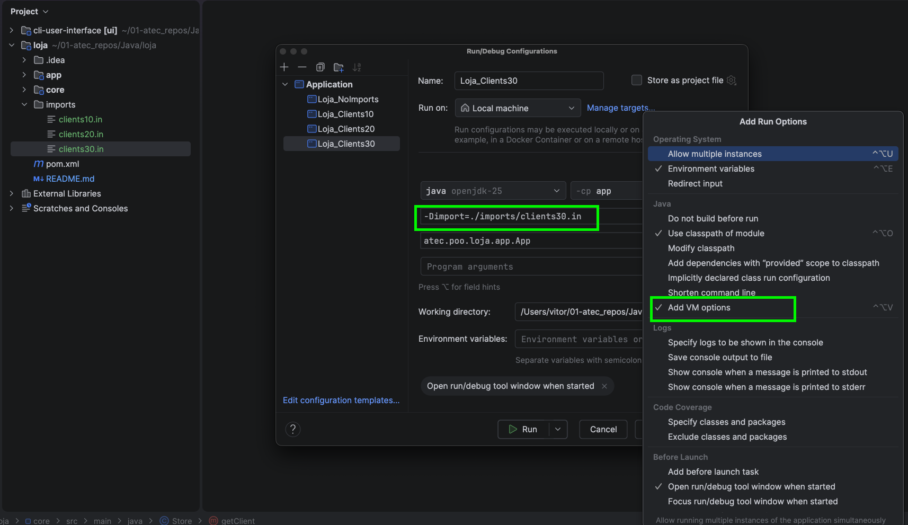

# Enunciado resumido — Gestão de uma Escola

<!-- TOC -->
* [Enunciado resumido — Gestão de uma Escola](#enunciado-resumido--gestão-de-uma-escola)
* [1. Introdução](#1-introdução)
* [2. Principais conceitos](#2-principais-conceitos)
  * [Escola](#escola)
  * [Aluno](#aluno)
  * [Professor](#professor)
  * [Turma](#turma)
* [3. Funcionalidades](#3-funcionalidades)
  * [3.1. Menu principal](#31-menu-principal)
    * [Abrir gestão de alunos](#abrir-gestão-de-alunos)
    * [Abrir gestão de professores](#abrir-gestão-de-professores)
    * [Abrir gestão de turmas](#abrir-gestão-de-turmas)
    * [Consultar resumo da escola](#consultar-resumo-da-escola)
  * [3.2. Menu Alunos](#32-menu-alunos)
    * [3.2.1. Criar aluno](#321-criar-aluno)
    * [3.2.2. Listar alunos por nome](#322-listar-alunos-por-nome)
    * [3.2.3. Listar alunos por idade](#323-listar-alunos-por-idade)
    * [3.2.4. Mostrar aluno](#324-mostrar-aluno)
  * [3.3. Menu Professores](#33-menu-professores)
    * [3.3.1. Adicionar professor](#331-adicionar-professor)
    * [3.3.2. Listar professores por idade](#332-listar-professores-por-idade)
    * [3.3.3. Listar professores por nome](#333-listar-professores-por-nome)
    * [3.3.4. Mostrar professor](#334-mostrar-professor)
  * [3.4. Menu Turmas](#34-menu-turmas)
    * [3.4.1. Criar turma](#341-criar-turma)
    * [3.4.2. Adicionar aluno a uma turma](#342-adicionar-aluno-a-uma-turma)
    * [3.4.3. Listar turmas](#343-listar-turmas)
    * [3.4.4. Mostrar turma](#344-mostrar-turma)
* [4. Regras principais](#4-regras-principais)
* [5. Conceitos importantes sobre arquitetura da Aplicação e Tratamento de exceções](#5-conceitos-importantes-sobre-arquitetura-da-aplicação-e-tratamento-de-exceções)
  * [5.1. Separação entre o `core`, a `app` e a biblioteca `ui`](#51-separação-entre-o-core-a-app-e-a-biblioteca-ui)
  * [5.2. Fluxo de tratamento de uma exceção](#52-fluxo-de-tratamento-de-uma-exceção)
  * [5.3. Exceções disponibilizadas no módulo `app`](#53-exceções-disponibilizadas-no-módulo-app)
    * [Tabela de utilização das Exceções - Por funcionalidade](#tabela-de-utilização-das-exceções---por-funcionalidade)
  * [5.4. Exemplo: criar uma turma com um professor inexistente](#54-exemplo-criar-uma-turma-com-um-professor-inexistente)
  * [5.5. Responsabilidades de cada camada](#55-responsabilidades-de-cada-camada)
  * [5.6. Nota importante](#56-nota-importante)
* [6. Importação de dados](#6-importação-de-dados)
  * [6.1. Objetivo](#61-objetivo)
  * [6.2. Formato dos ficheiros](#62-formato-dos-ficheiros)
    * [6.2.1. Importar um aluno](#621-importar-um-aluno)
    * [6.2.2. Importar um professor](#622-importar-um-professor)
  * [6.3. Comentários nos ficheiros](#63-comentários-nos-ficheiros)
  * [6.4. Método `importFile`](#64-método-importfile)
  * [6.5. Dividir uma linha em elementos](#65-dividir-uma-linha-em-elementos)
  * [6.6. Trabalho a realizar](#66-trabalho-a-realizar)
  * [6.7. Indicar o ficheiro através das opções da VM](#67-indicar-o-ficheiro-através-das-opções-da-vm)
  * [6.8. Configurar as opções da VM no IntelliJ IDEA](#68-configurar-as-opções-da-vm-no-intellij-idea)
  * [6.9. Configurações de arranque sugeridas](#69-configurações-de-arranque-sugeridas)
  * [6.10. Imagem da configuração no IntelliJ IDEA](#610-imagem-da-configuração-no-intellij-idea)
  * [6.11. Nota importante](#611-nota-importante)
<!-- TOC -->

# 1. Introdução

Pretende-se desenvolver uma aplicação de consola em Java para gerir uma escola.

A aplicação deverá permitir registar alunos e professores, criar turmas e associar alunos às respetivas turmas. O utilizador poderá consultar os dados através de um sistema de menus.

O projeto será organizado em camadas:

```text
ui
└── biblioteca responsável pela interação com o utilizador

app
└── menus, comandos, prompts e mensagens

core
└── classes do domínio e regras de negócio
```

A biblioteca `ui` já disponibiliza as classes necessárias para apresentar menus, ler dados e escrever mensagens. Os comandos do módulo `app` devem apenas recolher dados, invocar métodos do `core` e apresentar resultados.

---

# 2. Principais conceitos

A aplicação deverá representar os seguintes conceitos:

```text
Escola
Aluno
Professor
Turma
```

## Escola

A escola mantém a informação global da aplicação:

```text
Alunos registados
Professores registados
Turmas existentes
```

## Aluno

Cada aluno deverá possuir, pelo menos:

```text
Número de aluno
Nome
Data de nascimento
```

O número deverá ser único e é gerado pela aplicação

## Professor

Cada professor deverá possuir, pelo menos:

```text
Número de professor
Nome
Data de nascimento
```

O número deverá ser único e é solicitado ao user

## Turma

Cada turma deverá possuir:

```text
Código único
Professor responsável
Lista de alunos
```

Uma turma não pode ser criada com um código já existente.

---

# 3. Funcionalidades

## 3.1. Menu principal

```text
MENU PRINCIPAL
1 - Abrir gestão de alunos
2 - Abrir gestão de professores
3 - Abrir gestão de turmas
4 - Consultar resumo da escola
0 - Sair
```

### Abrir gestão de alunos

Abre o submenu que permite:

```text
Criar aluno
Listar alunos
Listar alunos por idade
Mostrar aluno
```

### Abrir gestão de professores

Abre o submenu que permite:

```text
Adicionar professor
Listar professores por idade
Listar professores por nome
Mostrar professor
```

### Abrir gestão de turmas

Abre o submenu que permite:

```text
Criar turma
Adicionar aluno a uma turma
Listar turmas
Mostrar turma
```

### Consultar resumo da escola

Apresenta uma visão global da escola:

```text
Número de alunos
Número de professores
Número de turmas
```

---

## 3.2. Menu Alunos

O menu de alunos permite registar novos alunos e consultar a informação dos alunos existentes.

```text
MENU ALUNOS
1 - Criar aluno
2 - Listar alunos (por nome)
3 - Listar alunos por idade
4 - Mostrar aluno
0 - Voltar
```

---

### 3.2.1. Criar aluno

Permite registar um novo aluno na escola.

O comando deverá solicitar os dados necessários através dos seguintes métodos da classe `Prompt`:

```java
Prompt.studentName()
Prompt.studentBirthDate()
```

Os métodos devolvem, respetivamente:

```java
String
LocalDate
```

Após recolher os dados, o comando deverá invocar o método adequado do `SchoolManager`.

Caso a operação seja concluída com sucesso, deverá ser apresentada uma mensagem através do método:

```java
Message.studentCreated(studentNumber)
```

Exemplo de output:

```text
Aluno número 1 criado com sucesso.
```

O sistema deverá gerar um id para cada aluno, sendo que o primeiro aluno a ser inserido é o aluno número `1`

---

### 3.2.2. Listar alunos por nome

Apresenta todos os alunos registados na escola, ordenados alfabeticamente pelo nome.

Caso existam dois alunos com o mesmo nome, deverá surgir primeiro o aluno com o menor número.

Esta funcionalidade não necessita de solicitar dados ao utilizador.

O comando deverá obter do `SchoolManager` uma lista de strings:

```java
ArrayList<String>
```

Cada elemento da lista deverá representar um aluno com o seguinte formato:

```text
[número] nome - idade anos
```

Exemplo:

```text
[2026001] Ana Silva - 17 anos
```

A lista completa deverá ser apresentada através do método:

```java
Message.studentsOrderedByName(students)
```

Exemplo de output:

```text
---- Lista de Alunos por Nome [3] ----
-> [2026001] Ana Silva - 17 anos
-> [2026003] João Costa - 16 anos
-> [2026002] Maria Santos - 18 anos
```

A ordenação deverá ser efetuada no `core`. A classe `Message` apenas apresenta as strings recebidas.

---

### 3.2.3. Listar alunos por idade

Apresenta todos os alunos registados na escola, ordenados por idade.

Os alunos mais velhos deverão surgir primeiro.

Caso existam dois alunos com a mesma idade, deverão ser ordenados alfabeticamente pelo nome.

Esta funcionalidade não necessita de solicitar dados ao utilizador.

O comando deverá obter do `SchoolManager` uma lista de strings:

```java
ArrayList<String>
```

Cada elemento da lista deverá possuir o mesmo formato utilizado na listagem por nome:

```text
[número] nome - idade anos
```

Exemplo:

```text
[2026002] Maria Santos - 18 anos
```

A lista completa deverá ser apresentada através do método:

```java
Message.studentsOrderedByAge(students)
```

Exemplo de output:

```text
---- Lista de Alunos por Idade [3] ----
-> [2026002] Maria Santos - 18 anos
-> [2026001] Ana Silva - 17 anos
-> [2026003] João Costa - 16 anos
```

A ordenação deverá ser efetuada no `core`. A classe `Message` apenas apresenta as strings recebidas.

---

### 3.2.4. Mostrar aluno

Permite consultar a informação completa de um aluno.

O comando deverá solicitar o número do aluno através do método:

```java
Prompt.studentNumber()
```

Após obter os dados do aluno através do `SchoolManager`, o comando deverá apresentar a respetiva ficha utilizando:

```java
Message.studentDetails(studentNumber, studentDetails)
```

O parâmetro `studentDetails` deverá ser uma string formatada no `core` com o seguinte formato:

```text
Nome: nome do aluno
Data de nascimento: dd/MM/yyyy
Idade: número de anos
Turma: código da turma
```

Caso o aluno ainda não tenha sido associado a uma turma, deverá ser apresentado:

```text
Turma: Sem turma
```

Exemplo de output:

```text
#### Ficha do Aluno [2026001] ####
Nome: Ana Silva
Data de nascimento: 12/03/2009
Idade: 17 anos
Turma: TPSI1025
#################################
```

Caso o aluno não exista, o `core` deverá lançar a exceção adequada.

---

## 3.3. Menu Professores

O menu de professores permite registar novos professores e consultar a informação dos professores existentes.

```text
MENU PROFESSORES
1 - Adicionar professor
2 - Listar professores por idade
3 - Listar professores por nome
4 - Mostrar professor
0 - Voltar
```

---

### 3.3.1. Adicionar professor

Permite registar um novo professor na escola.

O comando deverá solicitar os dados necessários através dos seguintes métodos da classe `Prompt`:

```java
Prompt.professorNumber()
Prompt.professorName()
Prompt.professorBirthDate()
```

Os métodos devolvem, respetivamente:

```java
int
String
LocalDate
```

Após recolher os dados, o comando deverá invocar o método adequado do `SchoolManager`.

Caso a operação seja concluída com sucesso, deverá ser apresentada uma mensagem através do método:

```java
Message.professorCreated(professorNumber)
```

Exemplo de output:

```text
Professor número 101 criado com sucesso.
```

O sistema deverá validar no `core` que não existe outro professor com o mesmo número.

---

### 3.3.2. Listar professores por idade

Apresenta todos os professores registados na escola, ordenados por idade.

Os professores mais velhos deverão surgir primeiro.

Caso existam dois professores com a mesma idade, deverão ser ordenados alfabeticamente pelo nome.

Esta funcionalidade não necessita de solicitar dados ao utilizador.

O comando deverá obter do `SchoolManager` uma lista de strings:

```java
ArrayList<String>
```

Cada elemento da lista deverá representar um professor com o seguinte formato:

```text
[número] nome - idade anos
```

Exemplo:

```text
[103] Ana Silva - 52 anos
```

A lista completa deverá ser apresentada através do método:

```java
Message.professorsOrderedByAge(professors)
```

Exemplo de output:

```text
---- Lista de Professores por Idade [3] ----
-> [103] Ana Silva - 52 anos
-> [101] João Costa - 45 anos
-> [102] Maria Santos - 38 anos
```

A ordenação deverá ser efetuada no `core`. A classe `Message` apenas apresenta as strings recebidas.

---

### 3.3.3. Listar professores por nome

Apresenta todos os professores registados na escola, ordenados alfabeticamente pelo nome.

Caso existam dois professores com o mesmo nome, deverá surgir primeiro o professor com o menor número.

Esta funcionalidade não necessita de solicitar dados ao utilizador.

O comando deverá obter do `SchoolManager` uma lista de strings:

```java
ArrayList<String>
```

Cada elemento deverá possuir o mesmo formato utilizado na listagem por idade:

```text
[número] nome - idade anos
```

Exemplo:

```text
[103] Ana Silva - 52 anos
```

A lista completa deverá ser apresentada através do método:

```java
Message.professorsOrderedByName(professors)
```

Exemplo de output:

```text
---- Lista de Professores por Nome [3] ----
-> [103] Ana Silva - 52 anos
-> [101] João Costa - 45 anos
-> [102] Maria Santos - 38 anos
```

A ordenação deverá ser efetuada no `core`. A classe `Message` apenas apresenta as strings recebidas.

---

### 3.3.4. Mostrar professor

Permite consultar a informação completa de um professor.

O comando deverá solicitar o número do professor através do método:

```java
Prompt.professorNumber()
```

Após obter os dados do professor através do `SchoolManager`, o comando deverá apresentar a respetiva ficha utilizando:

```java
Message.professorDetails(professorNumber, professorDetails)
```

O parâmetro `professorDetails` deverá ser uma string formatada no `core` com o seguinte formato:

```text
Nome: nome do professor
Data de nascimento: dd/MM/yyyy
Idade: número de anos
Turmas: códigos das turmas
```

Caso o professor ainda não esteja associado a qualquer turma, deverá ser apresentado:

```text
Turmas: Sem turmas
```

Exemplo de output:

```text
#### Ficha do Professor [101] ####
Nome: João Costa
Data de nascimento: 18/09/1980
Idade: 45 anos
Turmas: TPSI1025, TPSI0326
#################################
```

Caso o professor não exista, o `core` deverá lançar a exceção adequada.

---

A criação de alunos passa a usar um identificador automático e sequencial. No menu de turmas, esse identificador será utilizado para associar um aluno já existente a uma turma.

A turma terá um **código introduzido pelo utilizador**, porque códigos como `TPSI1025` ou `TPSI0326` possuem significado próprio e não devem ser gerados automaticamente.

## 3.4. Menu Turmas

O menu de turmas permite criar turmas, associar alunos a uma turma e consultar a informação das turmas existentes.

```text
MENU TURMAS
1 - Criar turma
2 - Adicionar aluno a uma turma
3 - Listar turmas
4 - Mostrar turma
0 - Voltar
```

---

### 3.4.1. Criar turma

Permite criar uma nova turma na escola.

O comando deverá solicitar os dados necessários através dos seguintes métodos da classe `Prompt`:

```java
Prompt.classCode()
Prompt.professorId()
```

Os métodos devolvem, respetivamente:

```java
String
int
```

O código identifica a turma e deverá ser introduzido pelo utilizador.

Exemplo:

```text
TPSI1025
```

O identificador do professor permite associar um professor responsável à turma.

Após recolher os dados, o comando deverá invocar o método adequado do `SchoolManager`.

Caso a operação seja concluída com sucesso, deverá ser apresentada uma mensagem através do método:

```java
Message.classCreated(classCode)
```

Exemplo de output:

```text
Turma "TPSI1025" criada com sucesso.
```

O sistema deverá validar no `core` que:

```text
Não existe outra turma com o mesmo código
O professor indicado existe
```

---

### 3.4.2. Adicionar aluno a uma turma

Permite associar um aluno já existente a uma turma.

O identificador do aluno foi atribuído automaticamente no momento da sua criação.

O comando deverá solicitar os dados necessários através dos seguintes métodos da classe `Prompt`:

```java
Prompt.classCode()
Prompt.studentId()
```

Os métodos devolvem, respetivamente:

```java
String
int
```

Após recolher os dados, o comando deverá invocar o método adequado do `SchoolManager`.

Caso a operação seja concluída com sucesso, deverá ser apresentada uma mensagem através do método:

```java
Message.studentAddedToClass(studentId, classCode)
```

Exemplo de output:

```text
Aluno ID: 3 adicionado com sucesso à turma "TPSI1025".
```

O sistema deverá validar no `core` que:

```text
A turma indicada existe
O aluno indicado existe
O aluno ainda não está associado à turma
```

---

### 3.4.3. Listar turmas

Apresenta todas as turmas existentes, ordenadas alfabeticamente pelo respetivo código.

Esta funcionalidade não necessita de solicitar dados ao utilizador.

O comando deverá obter do `SchoolManager` uma lista de strings:

```java
ArrayList<String>
```

Cada elemento da lista deverá representar uma turma com o seguinte formato:

```text
[código] - Professor: nome do professor [id] - Alunos: número de alunos
```

Exemplo:

```text
[TPSI1025] - Professor: João Costa [2] - Alunos: 3
```

A lista completa deverá ser apresentada através do método:

```java
Message.classes(classes)
```

Exemplo de output:

```text
---- Lista de Turmas [2] ----
-> [TPSI0326] - Professor: Ana Silva [1] - Alunos: 2
-> [TPSI1025] - Professor: João Costa [2] - Alunos: 3
```

A ordenação e a formatação das strings deverão ser efetuadas no `core`.

A classe `Message` apenas apresenta as strings recebidas.

---

### 3.4.4. Mostrar turma

Permite consultar a informação completa de uma turma.

O comando deverá solicitar o código da turma através do método:

```java
Prompt.classCode()
```

Após obter os dados através do `SchoolManager`, o comando deverá apresentar a ficha da turma utilizando:

```java
Message.classDetails(classCode, classDetails)
```

O parâmetro `classDetails` deverá ser uma string formatada no `core`.

Formato esperado:

```text
Professor: nome do professor [id]
Número de alunos: total
Alunos:
-> [id] nome do aluno - idade anos
```

Exemplo de output:

```text
#### Ficha da Turma [TPSI1025] ####
Professor: João Costa [2]
Número de alunos: 3
Alunos:
-> [1] Ana Martins - 17 anos
-> [3] Diogo Santos - 18 anos
-> [4] Maria Silva - 17 anos
##################################
```

Os alunos deverão ser apresentados por ordem alfabética do nome.

Caso a turma ainda não tenha alunos, deverá ser apresentado:

```text
Alunos: Sem alunos associados
```

Caso a turma não exista, o `core` deverá lançar a exceção adequada.

---

# 4. Regras principais

A aplicação deverá validar as operações realizadas. Exemplos:

```text
Não podem existir dois alunos com o mesmo número. Os numeros de alunos são sequênciais e gerados pelo sistema
Não podem existir dois professores com o mesmo número
Não podem existir duas turmas com o mesmo código
Não é possível adicionar um aluno inexistente a uma turma
Não é possível associar um professor inexistente a uma turma
Não é possível adicionar duas vezes o mesmo aluno à mesma turma
```

As validações pertencem ao módulo `core`. Os menus apenas devem apresentar os erros recebidos.

---


# 5. Conceitos importantes sobre arquitetura da Aplicação e Tratamento de exceções

## 5.1. Separação entre o `core`, a `app` e a biblioteca `ui`

As regras de negócio devem ser validadas no módulo `core`.

Por exemplo:

```text
Não podem existir dois professores com o mesmo número
Não podem existir duas turmas com o mesmo código
Não é possível consultar um aluno inexistente
Não é possível criar uma turma com um professor inexistente
Não é possível adicionar um aluno inexistente a uma turma
Não é possível adicionar a uma turma um aluno que já pertence a outra turma
```

O módulo `core` não deverá depender das classes existentes no módulo `app`.

Por esse motivo, os alunos poderão criar livremente as exceções que considerarem adequadas no `core`, escolhendo os respetivos nomes e a organização interna.

Exemplo:

```text
atec.poo.escola.core.exceptions
├── ProfessorNotFoundException
├── ProfessorAlreadyExistsException
├── StudentNotFoundException
├── SchoolClassNotFoundException
└── SchoolClassAlreadyExistsException
```

As exceções do `core` representam erros relacionados com as regras de negócio.

Quando uma exceção do `core` é lançada, o respetivo comando do módulo `app` deverá capturá-la e lançar uma das exceções disponibilizadas no package:

```text
atec.poo.escola.app.exceptions
```

As exceções fornecidas no módulo `app` herdam de:

```java
DialogException
```

A biblioteca `ui` captura automaticamente estas exceções e apresenta a respetiva mensagem ao utilizador.

---

## 5.2. Fluxo de tratamento de uma exceção

```text
Utilizador seleciona uma opção no menu
                 │
                 ▼
Comando do módulo app solicita os dados necessários
                 │
                 ▼
Comando invoca um método do SchoolManager
                 │
                 ▼
Core valida as regras de negócio
                 │
        ┌────────┴────────┐
        │                 │
        ▼                 ▼
 Operação válida     Operação inválida
        │                 │
        ▼                 ▼
 Core devolve       Core lança uma exceção
 o resultado        própria do domínio
        │                 │
        │                 ▼
        │          Comando da app apanha
        │          a exceção do core
        │                 │
        │                 ▼
        │          Comando lança uma exceção
        │          App...Exception
        │                 │
        ▼                 ▼
Mensagem de        Biblioteca ui apresenta
sucesso            a mensagem de erro
```

---

## 5.3. Exceções disponibilizadas no módulo `app`

Os alunos não deverão alterar estas classes.

| Exceção                                     | Situação em que deverá ser lançada            |
| ------------------------------------------- | --------------------------------------------- |
| `AppStudentNotFoundException`               | Não existe um aluno com o ID indicado         |
| `AppNoStudentsException`                    | Ainda não existem alunos registados           |
| `AppProfessorNotFoundException`             | Não existe um professor com o número indicado |
| `AppProfessorAlreadyExistsException`        | Já existe um professor com o número indicado  |
| `AppNoProfessorsException`                  | Ainda não existem professores registados      |
| `AppSchoolClassNotFoundException`           | Não existe uma turma com o código indicado    |
| `AppSchoolClassAlreadyExistsException`      | Já existe uma turma com o código indicado     |
| `AppNoSchoolClassesException`               | Ainda não existem turmas registadas           |
| `AppStudentAlreadyAssignedToClassException` | O aluno já está associado a uma turma         |

---

### Tabela de utilização das Exceções - Por funcionalidade

| Funcionalidade               | Exceções da camada `app`                                                                              |
| ---------------------------- | ----------------------------------------------------------------------------------------------------- |
| Listar alunos por nome       | `AppNoStudentsException`                                                                              |
| Listar alunos por idade      | `AppNoStudentsException`                                                                              |
| Mostrar aluno                | `AppStudentNotFoundException`                                                                         |
| Adicionar professor          | `AppProfessorAlreadyExistsException`                                                                  |
| Listar professores por idade | `AppNoProfessorsException`                                                                            |
| Listar professores por nome  | `AppNoProfessorsException`                                                                            |
| Mostrar professor            | `AppProfessorNotFoundException`                                                                       |
| Criar turma                  | `AppSchoolClassAlreadyExistsException`, `AppProfessorNotFoundException`                               |
| Adicionar aluno a turma      | `AppSchoolClassNotFoundException`, `AppStudentNotFoundException`, `AppStudentAlreadyInClassException` |
| Listar turmas                | `AppNoSchoolClassesException`                                                                         |
| Mostrar turma                | `AppSchoolClassNotFoundException`                                                                     |

## 5.4. Exemplo: criar uma turma com um professor inexistente

Considere que o utilizador tenta criar a turma:

```text
TPSI1025
```

e indica como responsável o professor:

```text
999
```

Caso o professor não exista, o método adequado do `core` poderá lançar uma exceção criada pelo aluno:

```java
package atec.poo.escola.core.exceptions;

public class ProfessorNotFoundException extends Exception {

    private final int professorNumber;

    public ProfessorNotFoundException(int professorNumber) {
        this.professorNumber = professorNumber;
    }

    public int getProfessorNumber() {
        return professorNumber;
    }
}
```

O comando `DoCriarTurma` deverá capturar essa exceção e convertê-la numa exceção do módulo `app`:

```java
package atec.poo.escola.app.turmas;

import atec.poo.escola.app.exceptions.AppProfessorNotFoundException;
import atec.poo.escola.core.exceptions.ProfessorNotFoundException;
import atec.poo.escola.core.SchoolManager;
import atec.poo.ui.Comando;
import atec.poo.ui.exceptions.DialogException;

public class DoCriarTurma extends Comando<SchoolManager> {

    public DoCriarTurma(SchoolManager schoolManager) {
        super(schoolManager, Label.CREATE_CLASS);
    }

    @Override
    public void executar() throws DialogException {
        String classCode = Prompt.classCode();
        int professorId = Prompt.professorId();

        try {
            getReceptor().createClass(
                    classCode,
                    professorId
            );

            Message.classCreated(classCode);

        } catch (ProfessorNotFoundException e) {
            throw new AppProfessorNotFoundException(
                    e.getProfessorNumber()
            );
        }
    }
}
```

A biblioteca `ui` apresenta automaticamente ao utilizador a mensagem definida no método `getMessage()`:


---

## 5.5. Responsabilidades de cada camada

| Camada | Responsabilidade                                                                                                       |
| ------ | ---------------------------------------------------------------------------------------------------------------------- |
| `core` | Implementar as regras de negócio e lançar exceções próprias do domínio                                                 |
| `app`  | Solicitar os dados, invocar o `SchoolManager`, apanhar exceções do `core` e convertê-las em exceções `App...Exception` |
| `ui`   | Apresentar menus, ler valores, capturar exceções que herdam de `DialogException` e mostrar as mensagens ao utilizador  |

---

## 5.6. Nota importante

As exceções criadas no módulo `core` podem possuir nomes diferentes dos utilizados nos exemplos.

O importante é garantir que:

```text
1. As regras de negócio são validadas no core
2. O core não depende do módulo app
3. Os comandos da app apanham as exceções lançadas pelo core
4. Os comandos lançam a App...Exception correspondente
5. A biblioteca ui apresenta a mensagem ao utilizador
```


# 6. Importação de dados

## 6.1. Objetivo

Para facilitar a realização de testes durante o desenvolvimento da aplicação, será possível importar alunos e professores a partir de um ficheiro de texto.

A importação permite inserir rapidamente vários dados na aplicação sem ser necessário utilizar repetidamente as opções dos menus.

Esta funcionalidade será implementada na classe:

```java
SchoolManager
```

através do método:

```java
public void importFile(String dataFile) throws IOException
```

O parâmetro `dataFile` contém o caminho para o ficheiro que deverá ser lido.

---

## 6.2. Formato dos ficheiros

Cada linha do ficheiro representa um registo.

Os diferentes valores de cada linha encontram-se separados pelo caráter:

```text
|
```

O primeiro valor identifica o tipo de registo:

```text
STUDENT
TEACHER
```

---

### 6.2.1. Importar um aluno

O formato utilizado para importar um aluno é:

```text
STUDENT|nome|data de nascimento
```

Exemplo:

```text
STUDENT|Ana Martins|2008-03-12
```

Os valores representam:

| Posição | Conteúdo                   | Tipo        |
| ------: | -------------------------- | ----------- |
|     `0` | Tipo de registo: `STUDENT` | `String`    |
|     `1` | Nome do aluno              | `String`    |
|     `2` | Data de nascimento         | `LocalDate` |

O ID do aluno **não é indicado no ficheiro**, porque deverá ser gerado automaticamente e sequencialmente pela aplicação.

A data utiliza o formato:

```text
yyyy-MM-dd
```

Exemplo:

```text
2008-03-12
```

Este formato permite converter diretamente o texto numa data através de:

```java
LocalDate.parse(elements[2])
```

---

### 6.2.2. Importar um professor

O formato utilizado para importar um professor é:

```text
TEACHER|número|nome|data de nascimento
```

Exemplo:

```text
TEACHER|101|João Costa|1980-09-18
```

Os valores representam:

| Posição | Conteúdo                   | Tipo        |
| ------: | -------------------------- | ----------- |
|     `0` | Tipo de registo: `TEACHER` | `String`    |
|     `1` | Número do professor        | `int`       |
|     `2` | Nome do professor          | `String`    |
|     `3` | Data de nascimento         | `LocalDate` |

O número do professor deverá ser convertido através de:

```java
Integer.parseInt(elements[1])
```

A data deverá ser convertida através de:

```java
LocalDate.parse(elements[3])
```

---

## 6.3. Comentários nos ficheiros

As linhas iniciadas pelo caráter:

```text
#
```

são comentários.

Estas linhas deverão ser ignoradas durante a importação.

Exemplo:

```text
# Importação de 10 alunos
# Formato: STUDENT|nome|dataNascimento
STUDENT|Ana Martins|2008-03-12
```

Os comentários permitem explicar o conteúdo do ficheiro sem afetar a execução da aplicação.

---

## 6.4. Método `importFile`

A classe `SchoolManager` irá receber inicialmente a seguinte estrutura:

```java
public void importFile(String dataFile) throws IOException {
    Scanner ler = new Scanner(new File(dataFile));

    while (ler.hasNextLine()) {
        String linha = ler.nextLine();

        // Ignorar linhas de comentários (#) no ficheiro
        if (linha.startsWith("#")) continue;

        String[] elements = linha.split("\\|");

        switch (elements[0]) {
            case "STUDENT":
                // TODO: invocar método de criação de STUDENT
                break;

            case "TEACHER":
                // TODO: invocar método de criação de TEACHER
                break;
        }
    }
}
```

O método percorre todas as linhas existentes no ficheiro.

Em cada linha:

```text
1. Lê o texto completo
2. Ignora a linha caso seja um comentário
3. Divide o texto utilizando o caráter |
4. Analisa o primeiro elemento
5. Invoca o método adequado para criar o registo
```

---

## 6.5. Dividir uma linha em elementos

A instrução:

```java
String[] elements = linha.split("\\|");
```

divide uma linha em várias partes.

Por exemplo, a linha:

```text
TEACHER|101|João Costa|1980-09-18
```

origina o seguinte array:

```text
elements[0] → TEACHER
elements[1] → 101
elements[2] → João Costa
elements[3] → 1980-09-18
```

O primeiro valor poderá ser analisado através de um `switch`:

```java
switch (elements[0]) {
    case "STUDENT":
        // Criar aluno
        break;

    case "TEACHER":
        // Criar professor
        break;
}
```

---

## 6.6. Trabalho a realizar

Os alunos deverão completar apenas as partes assinaladas com:

```java
// TODO
```

No caso dos alunos, deverá ser invocado o método adequado do `SchoolManager`, utilizando:

```java
elements[1]
LocalDate.parse(elements[2])
```

No caso dos professores, deverá ser invocado o método adequado do `SchoolManager`, utilizando:

```java
Integer.parseInt(elements[1])
elements[2]
LocalDate.parse(elements[3])
```

As validações das regras de negócio deverão continuar a ser realizadas no `core`.

Por exemplo:

```text
Não podem existir dois professores com o mesmo número
```

---

## 6.7. Indicar o ficheiro através das opções da VM

O ficheiro a importar poderá ser indicado através de uma opção da Máquina Virtual Java.

A aplicação deverá obter essa opção na classe principal através de:

```java
String dataFile = System.getProperty("import");
```

Caso tenha sido indicado um ficheiro, o respetivo nome será entregue ao método:

```java
schoolManager.importFile(dataFile);
```

Exemplo:

```java
String dataFile = System.getProperty("import");

if (dataFile != null) {
    schoolManager.importFile(dataFile);
}
```

A classe principal não necessita de conhecer o conteúdo do ficheiro.

A sua responsabilidade consiste apenas em:

```text
1. Obter o caminho indicado nas opções da VM
2. Entregar esse caminho ao SchoolManager
```

A leitura e interpretação dos dados são realizadas pelo método:

```java
importFile()
```

---

## 6.8. Configurar as opções da VM no IntelliJ IDEA

No IntelliJ IDEA, é possível criar diferentes configurações de arranque para executar a aplicação com diferentes ficheiros de importação.

Para configurar uma opção da VM:

```text
1. Abrir o menu Run
2. Selecionar Edit Configurations...
3. Escolher a configuração da aplicação
4. Localizar o campo VM options
5. Introduzir a opção pretendida
6. Guardar a configuração
7. Executar a aplicação
```

Exemplo:

```text
-Dimport=./imports/students10.in
```

A sintaxe utilizada é:

```text
-DnomeDaPropriedade=valor
```

Neste projeto:

```text
-Dimport=caminho-do-ficheiro
```

---

## 6.9. Configurações de arranque sugeridas

Podem ser criadas diferentes configurações no IntelliJ IDEA.

| Nome da configuração                                     | Opção da VM                         |
|----------------------------------------------------------|-------------------------------------|
| `Escola — Sem importação`                                | Não indicar qualquer opção          |
| `Escola — 10 alunos`                                     | `-Dimport=./imports/students10.in`  |
| `Escola — 20 alunos`                                     | `-Dimport=./imports/students20.in`  |
| `Escola — 5 professores`                                 | `-Dimport=./imports/teachers5.in`   |
| `Escola — 10 professores`                                | `-Dimport=./imports/teachers10.in`  |
| `Escola — Importação global` - 10 pofessores e 30 alunos | `-Dimport=./imports/global10_30.in` |

A configuração sem importação permite testar a aplicação vazia.

As restantes configurações permitem iniciar rapidamente a aplicação com diferentes conjuntos de dados.

---

## 6.10. Imagem da configuração no IntelliJ IDEA



---

## 6.11. Nota importante

Os ficheiros de importação são utilizados apenas para facilitar os testes.

A aplicação deverá continuar a permitir criar alunos e professores através dos respetivos menus.

O funcionamento correto da aplicação não poderá depender da existência de um ficheiro de importação.
