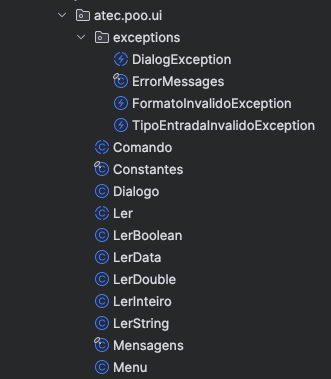
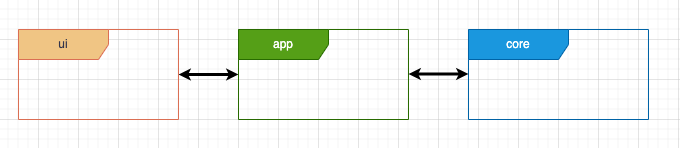

# Módulo UI

<!-- TOC -->
* [Módulo UI](#módulo-ui)
  * [Enquadramento e principais conceitos](#enquadramento-e-principais-conceitos)
    * [Padrão de arquitetura em Camadas](#padrão-de-arquitetura-em-camadas)
      * [Camada de Apresentação / User Interface -  `ui`](#camada-de-apresentação--user-interface---ui)
      * [Camada de Serviços / Aplicação -  `app`](#camada-de-serviços--aplicação---app)
      * [Camada de Domínio - `core`](#camada-de-domínio---core)
  * [Principais classes e exemplos da framework `ui`](#principais-classes-e-exemplos-da-framework-ui)
    * [Classe Menu](#classe-menu)
    * [Classe Comando](#classe-comando)
    * [Classe Dialogo](#classe-dialogo)
    * [Classe Ler e as suas subclasses especializadas](#classe-ler-e-as-suas-subclasses-especializadas)
    * [Classe Cosntantes](#classe-cosntantes)
    * [Classe Mensagens](#classe-mensagens)
    * [Excepções](#excepções)
<!-- TOC -->

O Módulo UI é uma biblioteca com Classes e Interfaces que apoia a criação de menus e se responsabiliza pela interação com o Utilizador

## Enquadramento e principais conceitos

A biblioteca (framework) encontra-se dentro do package `atec.poo.ui` e, conforme imagem abaixo, possui um conjunto de classes que podem ser utilizadas para implementar um sistema de menus (funcionalidades do sistema), as quais serão implementados num módulo diferente (`app`).

Tipicamente essa lógica de implementação (os menus) será efetuada no módulo `app`, o qual é responsável por gerir toda a lógica da aplicação,
interligando a biblioteca que é responsável pela gestão da interação com o utilizador (`ui`) com toda a lógica de negócio (`core`)

### Padrão de arquitetura em Camadas

A arquitetura em camadas, é uma abordagem estruturada para organizar aplicações de forma que cada camada tenha responsabilidades claras e distintas. Isso facilita a manutenção, escalabilidade e entendimento do sistema.
1. **Camada de Apresentação (UI/Interface do Utilizador)**
   - **Responsabilidade**: Interagir com os Utilizadores finais. Receber entradas e exibir saídas.
   - **Componentes Comuns**: Controladores, views, APIs REST, páginas web, interfaces gráficas.
2. **Camada de Aplicação**
   - **Responsabilidade**: Orquestrar a execução das operações de negócio. Coordenar tarefas e gerenciar fluxos de trabalho.
   - **Componentes Comuns**: Serviços de aplicação, gestores de transação, controladores de fluxo.
3. **Camada de Domínio**
   - **Responsabilidade**: Contém a lógica de negócio central do sistema. Definir as regras de negócio e os comportamentos principais.
   - **Componentes Comuns:** Entidades, agregados, repositórios, serviços de domínio.
4. Camada de Infraestrutura
   **Responsabilidade:** Suporte técnico para outras camadas. Implementar interfaces e fornecer acesso a recursos externos.
   **Componentes Comuns:** Implementações de repositórios, serviços de comunicação, bibliotecas de terceiros, acesso a bases de dados, etc.

> Veja abaixo uma explicação mais detalhada das camadas, numa lógica do que se pretente neata UFCD. Para o efeito não se apresenta a camada de infraestrutura pois não irá ser utilizado uma Ligação a Bases de Dados

#### Camada de Apresentação / User Interface -  `ui`

A camada de apresentação é responsável pela interação com o utilizador. 
É esta camada a responsável por apresentar os dados ao utilizador e recolher os dados inseridos pelo utilizador. 
Esta camada é totalmente suportada pelo módulo `ui`. (Os formandos não necessitam alterar a framework)

Esta framework (conjunto de funcionalidades) é de código aberto e foi desenvolvida pelo Instituto superior Técnico e adaptada pelo formador para as aulas de POO

#### Camada de Serviços / Aplicação -  `app`

A camada de serviços é a camada intermédia entre a camada de lógica de negócio (Core) e a camada de apresentação. 
A camada de serviços é uma camada cujas entidades são relativamente simples. Esta camada é responsável pela definição da interação com o utilizador que deve ser suportada pela aplicação. 
Ou seja, implementa as funcionalidades (menus, etc), onde cada funcionalidade que se quer oferecer ao utilizador deve ser concretizada utilizando as funcionalidades da camada `ui`.

A classe abstrata `Comando` fornecida pela framework `ui` é uma abstração que representa genericamente uma funcionalidade sobre a aplicação que se quer disponibilizar ao utilizador. 

Por exemplo, no contexto de uma aplicação Escola, se quisermos que o utilizador possa criar um estudante ou uma turma, então teremos que ter duas subclasses de `Comando`, cada uma responsável por uma destas funcionalidades. 
Cada subclasse implementada será responsável por pedir os dados ao utilizador necessários para realizar a funcionalidade pretendida (Utilizando a classe `Ler) e também por apresentar o resultado que resulta da execução da funcionalidade pretendidada.

> Mais abaixo, neste tutorial, estarão exemplos de como utilizar cada Classe da framework.

#### Camada de Domínio - `core`

Esta camada (também designada como camada de **lógica de negócio** ou camada **core**) contém a realização de todas as entidades que são responsáveis pela lógica de negócio da aplicação a desenvolver. 
Esta camada é assim constituída por um conjunto de classes que modela e concretiza o domínio da aplicação a desenvolver. Por exemplo, numa aplicação para uma escola, as entidades do domínio incluiriam as classes Escola, Estudante e Professor as quais concretizariam as funcionalidades inerentes às entidades do mundo real modeladas por estas classes.

> O Core de uma aplicação é o conjunto de classes que modela e realiza o problema proposto. 
> A interface com o utilizador (ui) dá um aspeto visível possível através do qual se podem realizar pedidos ao núcleo. 
> Uma aplicação pode suportar diferentes interfaces (por exemplo gráficas como o JavaFX, Swing, etc.) com o utilizador. Por esta razão, o núcleo nunca deve aceder à `ui`. Da mesma forma, a _interface_ utilizador não deve realizar operações que representam lógica de negócio relacionada com o core da aplicação, mas apenas recolher dados, passá-los a um ou mais métodos do core, e apresentar os resultados obtidos do core.

## Principais Classes e exemplos da framework `ui`

### Classe Menu

### Classe Comando

### Classe Dialogo

### Classe Ler e as suas subclasses especializadas

### Classe Cosntantes

### Classe Mensagens

### Excepções

